# Architecture

Agentic SDLC separates the reusable method from project-specific knowledge.

```text
Plugin (Codex or Claude Code)
  -> skill instructions
  -> templates
  -> schemas
  -> cross-platform CLI

Target project
     -> .sdlc/
        -> baseline
        -> assessments
        -> budgets
        -> contracts
        -> autonomy
        -> authorizations
        -> authorization-uses
        -> receipts
        -> capability-discovery
        -> output-contracts
     -> work-items
     -> work-breakdown
     -> dependencies
     -> stories
     -> orchestration
     -> locks
     -> handoffs
     -> decisions
     -> traces
     -> tests
     -> releases
     -> manifests
     -> archive
     -> cache
     -> indexes
```

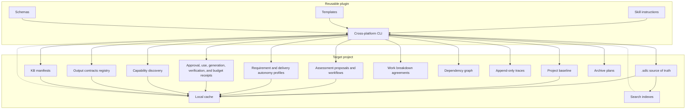

## Code Layout

The CLI is layered so that every rule can be tested without spawning a process.

| Layer | Location | Role |
|---|---|---|
| Entry point | `bin/agentic-sdlc.mjs` | Composition root only: `main`, the command registry, and the observatory launcher that needs the script's own path. |
| Engine | `lib/engine/*.mjs` | Command implementations, storage, git, delivery, workflow and gate code: everything that reads or writes. |
| Rules | `lib/lifecycle/*.mjs` | Pure validators, normalizers and decision helpers with no I/O anywhere in their reference closure. |
| Host seam | `lib/runtime/host.mjs` | The only route to the outside world. |

No module other than the host seam imports `node:fs`, `node:fs/promises`, `node:child_process`, `node:os` or `node:crypto`, or reads the `process`, `console` or `Date` globals directly: the entry point, the engine, the rules and the feature modules under `lib/` (observatory, delivery providers, metering adapters, release verification, trace integrity) all import those names from the host. Each member forwards to the real implementation unless a test replaces it with `setHost()`, which returns a restore function. Methods are resolved when they are called, so a function taken from a member at load time (`const { readFileSync } = fs`) follows the replacement too. A test can therefore run any function against a fixed clock, a fixed random source or a recording file system without changing it; `test/unit/runtime-host.test.mjs` shows the pattern and fails if a module bypasses the seam.

Constants and classes shared by the engine live in `lib/engine/definitions.mjs` in the order they are initialized, so no value is read before it exists, whichever module is loaded first. `lib/runtime/paths.mjs` provides `PLUGIN_ROOT`.

## Core Design Choices

The plugin is static and reusable. It contains the SDLC process, CLI, schemas, and templates.

The project knowledge base is dynamic and shared. It is created inside the target repository so it can be reviewed, branched, merged, and audited with normal Git workflows.

The source of truth is text and JSON. Cache and search indexes are derived artifacts that can be rebuilt. Reports are durable evidence when they support a review, gate, or release decision.

The scale layer is source-backed and explicit. `report activity` reads trace JSONL and reports source file/line for each statement. `manifest rebuild` creates a shared compact KB map from canonical files. `trace compact` creates additive summaries while retaining raw traces. `archive closed` is plan-first and only moves old reports or compactions with explicit `--apply`.

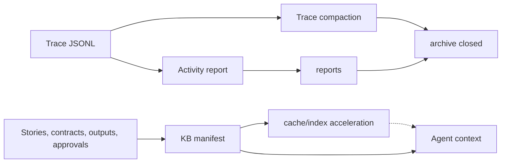

During `init`, the plugin copies the effective SDLC configuration to `.sdlc/config.json`. Later gate and orchestration commands read that project-local config, so a different `--template-dir` cannot silently weaken an initialized project's policy.

## Local Observability And Integrity Boundary

The practical goal is simple: when an operation fails, an operator can connect
the error to the relevant local activity without exposing project content or
pretending that a local hash is a trusted signature.

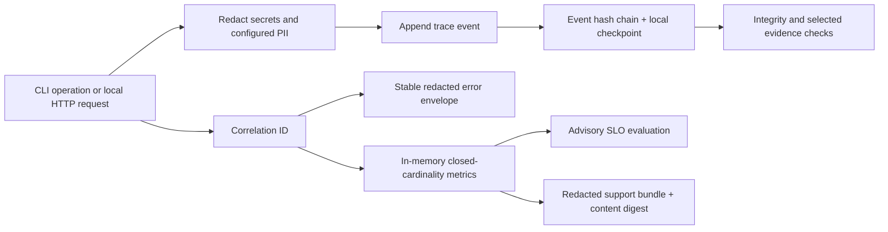

Every new general trace event receives a sequence, previous-event hash, and
event hash. A sibling checkpoint under `.sdlc/traces/.integrity/` anchors the
legacy prefix and the newly sealed chain. Appends use a local lock, no-follow
file opens, synchronized writes, and atomic checkpoint replacement. Recovery
may adopt a complete valid event or remove only an interrupted partial tail; it
does not silently discard a complete invalid record. Strict gates verify the
trace/checkpoint pair and any evidence reference marked for current-content
verification.

This mechanism provides local tamper evidence and content integrity. It can
detect an edited, reordered, truncated, or mismatched trace, but it does not
authenticate the actor, origin, or time and is not tamper-proof. A privileged
party able to replace both the trace and checkpoint can construct another
consistent pair. Authenticity requires an independent signed or append-only
anchor outside this local boundary.

Operational redaction runs before trace persistence and again at Observatory
presentation boundaries. Sensitive keys, known credential forms, configured
secret/PII patterns, email addresses, bearer values, credential assignments,
and private-key blocks are replaced. Entropy alone never classifies a value as
a secret. SHA digests, UUIDs, `corr-<uuid>` values, exact
`AUT-ACT-<timestamp>-<suffix>` authorization action IDs, and other opaque audit
references therefore remain readable unless an explicit privacy rule matches
them. Identifier allow rules cannot override a credential detector or a
configured secret/PII pattern. Trace evidence fingerprints use the redacted
UTF-8 representation rather than the original sensitive bytes.

One `corr-<uuid>` context follows a CLI operation or Observatory request into
trace records, response headers, and stable error envelopes. Unexpected errors
are normalized before display, so callers receive a safe error code,
retryability, and correlation ID without a stack, token, secret-bearing path,
or raw exception detail. A safe canonical or project-relative path may be
retained when it is the actionable location the operator must correct.

Change Observatory keeps request, latency, cache, and readiness metrics only in
process memory. Metric labels come from fixed allowlists, so a path, story ID,
token, or error message cannot create unbounded series. Availability and
readiness objectives are advisory and report insufficient data until the
configured minimum sample count is reached. The support bundle contains only
allowlisted redacted sections and a SHA-256 digest of its canonical redacted
content; that digest detects content changes but is not a signature or proof of
origin. `external_sinks: disabled` is enforced by configuration, so the plugin
does not export these signals.

The Observatory model cache still validates the canonical project revision.
Its strong `ETag` is retained by the browser client only in memory; a later
`If-None-Match` request can reuse the same model on `304`. A `304` without a
matching client cache fails closed instead of displaying an unknown model.

## Command-Scoped Canonical Queries

Each read-heavy command opens one bounded query session over the canonical `.sdlc` tree. The session builds its sorted file catalog lazily once, memoizes parsed JSON and JSONL by content hash, and reuses small deterministic indexes for story, requirement, output, dependency, and trace lookups. This removes repeated directory walks and all-pairs joins without changing command output, exit codes, or the source of truth.

The session never treats configured derived directories such as `.sdlc/cache/` or `.sdlc/indexes/` as canonical input. Writers invalidate the affected session state; a later command can always rebuild it from source files. Paths still pass through the canonical store boundary, including traversal, outside-root, and symlink checks.

The reproducible enterprise benchmark exercises 1,000 source files, 1,000 stories, 10,000 work records, 5,000 dependency edges, and 100,000 trace events. It enforces a single catalog build, complete deterministic counts, platform-specific query and warm-response latency budgets, and a bounded RSS budget on Unix and Windows.

## Existing Project Baseline

Existing repositories do not have a reliable SDLC history. The plugin creates a baseline of the observable current state instead of inventing past decisions.

`onboard existing-project` initializes `.sdlc/` when needed, scans repo manifests and key files, imports user-provided documents as hashed evidence, and writes:

- `.sdlc/baseline/<id>.json` as the machine-readable baseline proposal;
- `.sdlc/baseline/<id>-current-state.md` as a readable review artifact.

The baseline starts as `proposed`. It marks inferred facts as not approved and records open questions. Only a formal baseline approval can move it to canonical project context.

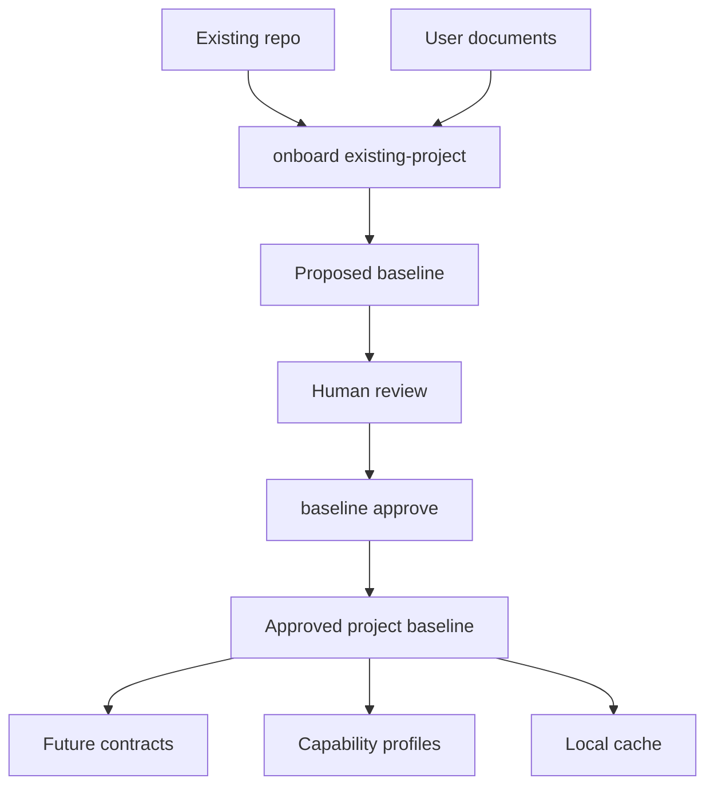

## Assessment Control Plane

The assessment journey is a dedicated state machine with exactly two normal checkpoints. Checkpoint 1 approves only the project baseline. `assessment proposal prepare` then builds a complete immutable approval payload containing baseline hash, requirement/story reservation, deliverable, capabilities, contract draft, route intent, write-set, execution budget, security, approval boundary, and idempotent application plan.

Checkpoint 2 approves the `proposal_hash`, not a free-text intention. `assessment proposal approve` records host/CI authority and creates a proposal-bound content authorization. `assessment proposal apply` applies only the displayed write-set and can resume after a partial failure without duplicating records. Runtime state lives in `assessment_workflow:v1`; it is not part of the immutable approval payload.

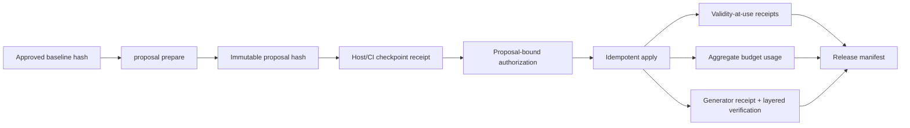

Budget policy is data-driven. Project configuration supplies the default budget template (`budget_policy.defaults`, soft limits only as shipped), project-wide warning thresholds and completion reserve (which take precedence over the template; a proposal's own `--budget-json` values take precedence over both), and `budget_policy.maxima`, the largest soft or hard limit a proposal or amendment may set per metric. A new budget is refused when a metric name is not a simple lowercase identifier, a limit is 0, a unit is unknown or inconsistent with its currency, a limit action has no implemented effect, or a limit exceeds its maximum. A hard limit is valid only for exactly metered usage. Amendments reference the approved base budget and proposal hashes; they never mutate the base tranche or widen scope.

## Configurable Workflow Plane

The reusable workflow engine separates process order from execution authority. A versioned definition says which states and transitions exist. A governed overlay may change human labels, descriptions, metadata, and parameters for an already allowlisted guard, but cannot change identifiers, initial state, transition direction, ordered phases, or recorded history.

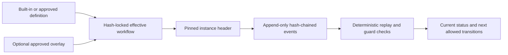

The engine ships software-project, change-request, technical-assessment, and generic-governed-process presets. The software preset preserves the exact seven existing phases: discovery, analysis, design, implementation, validation, release, and operations. The assessment preset preserves exactly two normal user checkpoints and complements, rather than replaces, `assessment-proposal:v1` and `assessment-workflow:v1`.

An instance pins the definition, optional overlay, and effective content hashes at start. A later definition or overlay version affects only a new instance. Events carry a monotonic sequence, previous-event hash, event hash, actor, timestamp, and idempotency key. Replay fails closed for modified, reordered, duplicated, or truncated evidence when a known checkpoint is supplied. Guards are declarative allowlisted identifiers with validated parameters; workflow records are never evaluated, dynamically imported, or passed to a shell.

Workflow approval grants no filesystem, tool, external-service, merge, or release authority. Those limits remain in requirements, contracts, capability policy, and the non-reusable profile selected for each pull request or local release. See [Configurable workflows](configurable-workflows.md) for the user and CLI journey.

## Autonomy Control Plane

Autonomy is represented by separate, composable records rather than a global trust score:

- `requirement:v2` is the immutable, revisioned business requirement;
- `requirement-execution-profile:v1` is its approved maximum autonomy envelope;
- `delivery-execution-profile:v2` is the user's explicit selection for one `pull_request` or `local_release`, including exact verification-provider bindings;
- historical `delivery-execution-profile:v1` records remain byte- and hash-compatible and receive only an in-memory legacy provider mapping;
- `autonomy-decision:v1` is the deterministic explanation of the effective result.

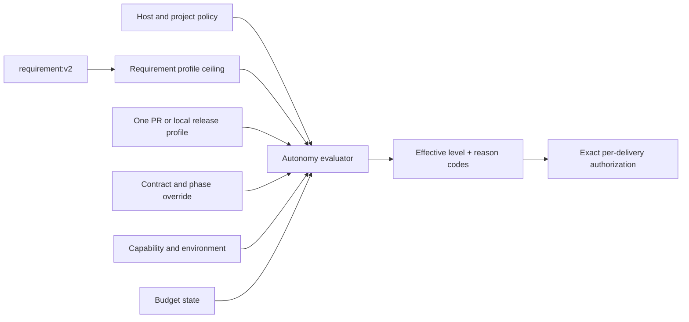

The evaluator computes the most restrictive result across host, project, requirement, delivery, contract, capability, environment, and budget. A downstream layer can only narrow authority. Multiple linked requirements use the lowest ceiling. Missing, unknown, stale, expired, revoked, or materially drifted inputs fail closed.

In user-facing language, the three choices mean: work together at every important step, let the agent proceed between agreed checkpoints, or let it complete the agreed PR independently. The choice is made separately for each PR or local release and never carries over automatically. The interface leads with what the agent may do, when it will stop, and where the choice applies; implementation codes appear only in technical details.

Internally those levels are `supervised`, `checkpointed`, and `bounded-autonomous`. `audit_only` authority is capped at `checkpointed`, including for local targets. Effective `bounded-autonomous` requires an external host/CI Ed25519 receipt for the exact delivery-profile approval subject, `authority_policy.mode: host_verified`, its public key in `trusted_host_keys`, and that receipt at approval time. The CLI validates but cannot self-issue trusted authority. Previous delivery history may support a recommendation but is not an input that can increase authority.

Delivery profiles are exact and terminal. One profile binds exactly one story and its one approved contract; an agreed aggregation story/contract is required when several changes must ship together. A pull-request profile binds repository, base branch, head branch, canonical actions, explicit write paths, material scope, and requirement profile hashes. A local-release profile binds a local target root, allowed writes/actions, shell-free JSON-argv smoke tests, and rollback while keeping external, production, and destructive access false. Neither profile may be reused for another delivery. Protected-branch merge and remote or production deployment are explicit exceptions.

Delivery binding is intentionally one-way to avoid circular hashes: reserve the planned profile ID in the final requirement-bound story contract, approve that contract, then bind the matching delivery profile to the immutable requirement-profile, story, and contract hashes. The ID is not a profile hash or approval. Task start supplies the profile to the evaluator; the approved contract is not rewritten to point back to it.

Task-start automation comes from the effective level's configured `automatic_phases`, not from a hardcoded progression or successful-run count. `supervised` always confirms. The stock `checkpointed` preset starts analysis, design, implementation, and validation automatically but retains release checkpoints.

Delivery actions form a receipt chain: immutable start → exact action authorization → external/host execution → outcome plus evidence → terminal close. An authorization receipt is policy, not an executor. A checkpoint under `host_verified` additionally requires an external Ed25519 receipt whose action is `autonomy.delivery.action.<canonical-action>` and whose subject binds the exact profile, delivery, runtime target, and action details; `audit_only` records the explicit approval without claiming verified authority. Passing `release.local` uses a v3 authorization → durable attempt → completion chain. The runner rejects shells, indirect dispatchers, inline code and ambiguous loaders, binds explicit interpreted entrypoints to the artifact manifest, denies external networking, denies loopback on macOS, and exposes only namespace-local loopback on Linux. It automatically closes `released` only after the artifact remains unchanged. It can still read host-account files and does not attest transitive imports, so reviewed artifact code must not execute ungoverned host paths. Passing `pull_request.merge` completion closes `merged`; a merge a person made on GitHub is acknowledged afterwards by `autonomy delivery reconcile`, which closes the delivery as `merged_externally` (or adds its receipt next to a `ready_for_review` close) and never counts as a governed merge; a pull request whose profile excludes merge closes `ready_for_review` only by binding its latest passing `pull_request.create` or `pull_request.update` completion. The CLI validates local Git identity, branches, SHA transitions, paths, and evidence hashes, but currently relies on a host/CI/provider for durable proof that a remote push or merge actually occurred.

## Intent Routing Layer

The routing layer separates language understanding from deterministic SDLC control. Codex or another LLM normalizes the user conversation into the canonical intent schema; the CLI consumes only that JSON plus project-local `.sdlc/` state.

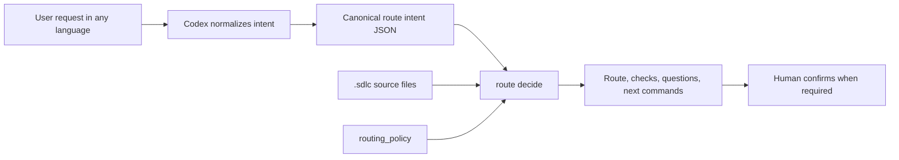

This keeps the deterministic layer language-agnostic: it does not search for words in the user's sentence. It validates configured `requested_action` values, confidence, referenced entities, missing context, artifact type, phase skips, story claims, contracts, and output registry state. `route decide` does not create source-of-truth artifacts; it returns a plan that the agent and user can accept, adjust, or rerun with a corrected intent.

`assessment_workflow.requested_actions` is the configurable route boundary for the dedicated assessment journey. When an intent matches, task start must require the approved baseline and immutable combined proposal instead of entering a generic contract path. `open_question_guidance` separately maps unresolved questions to configurable reasons, bilingual examples, and proposal effects, with an explicit fallback; classification never grants authority or changes the question itself.

## Contract Model

Every SDLC phase is governed by a contract. A contract defines:

- phase objective;
- responsible agent role;
- required inputs;
- required outputs;
- validation criteria;
- allowed tools;
- required knowledge base writes;
- human approval gate;
- requirement execution profile and delivery execution profile references;
- any per-phase autonomy override, which may only narrow the effective level;
- Codex execution policy for model and reasoning inheritance or override;
- operational metrics.

This keeps agent work bounded and reviewable. The contract does not grant autonomy by itself; it participates in the restrictive intersection evaluated for the current delivery.

Story-specific contracts can also declare `output_contract_refs` using `type:template:mode[:phase]`. The optional phase scopes when an output becomes due in the bound workflow. Legacy unphased references remain all-due at every strict gate. Phased references are due cumulatively through the current workflow phase, so an intermediate strict gate defers future-phase references; a lifecycle-complete strict gate requires every declared output. An output-producing story contract must declare at least one exact current-phase or legacy all-due ref, preventing a future-only brief from being approved. Approval prompts show the phase of every ref, and output-link requests use the trusted workflow position so future outputs are not requested early. Each due output ref must be satisfied by a linked artifact in `.sdlc/output-contracts/registry.json`. Contract approvals store a stable hash of the approved contract content; changing the contract after approval requires a new approval.

Contracts can declare `capability_policy`, `capability_bindings`, and `capability_recommendation_refs` to record agreed skills, MCPs, tools, concrete targets, permissions, source recommendations, and actions that require approval. Strict gates reject invalid policies, required MCP/tool capabilities that have neither a binding nor an explicit open contract question, stale recommendation refs, and install-required capabilities without install approval.

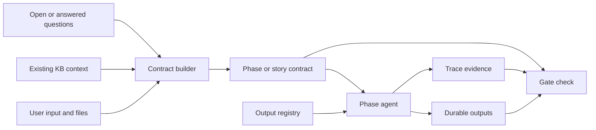

## Approval Governance

The approval model separates operational authorization from formal SDLC approval. A user saying "implement and push" does not automatically approve a contract, output template, baseline, requirement ceiling, delivery autonomy selection, capability recommendation, dependency graph, duplicate-output decision, or assessment proposal.

Formal approvals store:

- approver actor and type;
- `approval_source` such as `explicit-user`, `ci`, `automation`, or `bootstrap`;
- summary or immutable evidence;
- approved content hash;
- Git and Codex run metadata.

For new assessment and autonomy workflows, a human actor flag plus summary is insufficient by itself. A host/CI receipt binds the exact question, immutable subject hash, response, actor, host message, and timestamp. The derived content authorization enumerates exact actions, subject IDs/hashes, delivery identity, artifact types, validity, and use policy. Each mutation writes a snapshot receipt evaluated at the use timestamp; closing or revoking the grant blocks future use without rewriting history. `bootstrap` remains provisional and does not satisfy strict gates by default.

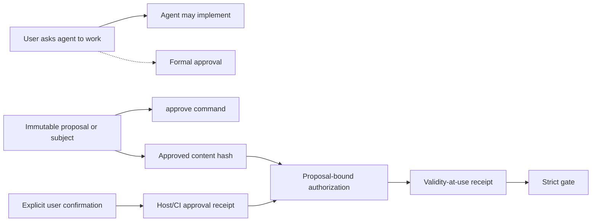

## Capability Discovery Layer

Capability discovery is a project-specific architect step before technical analysis or high-impact contract creation. The plugin stays agnostic: Codex or another LLM can normalize context into profile and recommendation JSON, while the CLI only validates and persists canonical records with evidence and approvals.

`.sdlc/capability-discovery/` stores approved profiles and recommendations:

- profiles describe the story/project subject, detected stack, constraints, integrations, evidence, confidence, source paths, and source hashes;
- recommendations describe skills, MCPs, tools, plugins, connectors, models, bindings, decision matrices, open questions, install requirements, and execution-policy suggestions;
- contract refs store the approved recommendation hash, so changing a recommendation after approval makes downstream gates fail.

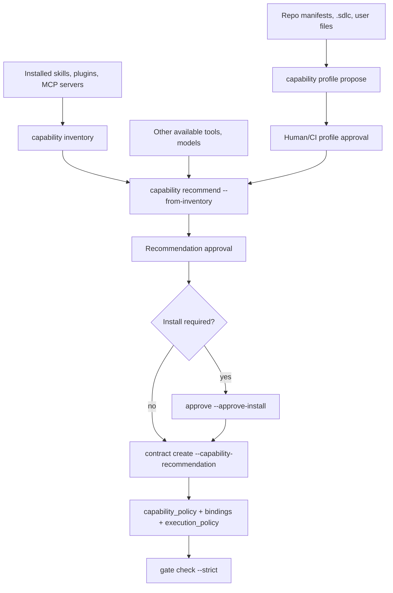

### Installed-capability inventory

The agent no longer has to build the list of available capabilities by hand. `capability inventory` is a read-only command that discovers what is already installed for the current user and project, from well-known local locations only and without network access:

- skill directories (`<name>/SKILL.md`) in the project and in the user's home, for both supported agent hosts;
- command directories (`*.md`);
- the plugin caches of both hosts, where each plugin manifest names its skills and commands directories (a cache keeps superseded versions; only the newest version of a plugin is listed);
- MCP servers declared in JSON settings (`.mcp.json`, host settings files, and the user and per-project sections of the host's user settings) and in TOML host configuration (`[mcp_servers.<name>]` tables).

Only names, one-line descriptions from the front matter or manifest, plugin versions, and a server's transport type are kept. The parsers look at key presence, never at values, so server arguments, environment, headers, and URLs cannot reach the output, a record, or a message. Paths are reported project-relative or `~`-relative (a relocated host directory is shown as `(external)/…`); a project location cannot reach outside the project through a link; sizes, depths, entry counts, and the number of names examined per directory (`limits.max_listing_names`) are bounded and reported as `truncated` when reached; a skill file or manifest that is a link leaving the project is ignored like its directory; invisible and bidirectional control characters are removed from descriptions.

The locations are configuration, not code. `capability_discovery_policy.inventory` in `.sdlc/config.json` (defaults in `templates/sdlc-config.json`, validated by `schemas/sdlc-config.schema.json`, and built in for projects whose configuration predates the setting) lists the sources: each has an `id`, a `kind` (`skills`, `commands`, `plugins`, `mcp-json`, or `mcp-toml`), a `scope` (`project` or `user`), and a `path` that is project-relative, `~`-relative, or `${VARIABLE:-default}`-based (so a host that relocates its directory is honoured). Only `CLAUDE_CONFIG_DIR`, `CODEX_HOME`, `HOME`, `USERPROFILE`, `XDG_CONFIG_HOME`, and `APPDATA` may be referenced; the configuration and schema refuse any other variable, so a path can never carry another environment value into the output. `sources` replaces the default list when given, which lets a team point at its own directories or add another host without code changes; `enabled` turns discovery off; `suggest` turns only the suggestions below off; `limits` bound the scan.

`capability recommend --from-inventory` uses the inventory as the available capabilities and is validated like any other recommendation. An inventory lists everything installed, not what the work needs, so a deterministic match narrows it: only entries whose name or description names a technology declared by the approved profile (its detected stack and integrations) are proposed, at most `matching.max_suggestions`. Tags are split into words; generic words (`matching.ignored_tags`), very short words, and ambiguous words (`matching.ambiguous_tags`, such as a language called "go") do not match on their own, a weak word (`matching.weak_tags`, programming languages and runtimes by default) makes an entry relevant only when it is in the entry's name, since many unrelated capabilities mention in their description the language they are written for, and `matching.aliases` adds alternative spellings. The wording of a request is never consulted, and every other installed entry is not written into the recommendation when it comes from the user's home (only a count, `available_capabilities.omitted_user_scope`, is kept, because the record is committed with the project); a project-level entry that was not chosen is kept by name with `recommended: false`. The result is a `proposed` recommendation that still needs approval; nothing is bound automatically.

The same matching drives a proactive suggestion. When `task start` (for contract, analysis, implementation, validation, and release work) or `status` finds a story without any capability recommendation, and installed capabilities match its declared technology, the result carries a `capability_suggestion` and a short plain-language sentence: which installed tools look relevant, that nothing is used or approved yet, and the commands that would record a recommendation (the approved profile's tags when there is one, otherwise the same deterministic project detection a profile starts from, in which case the profile comes first). The suggestion never changes the outcome, blockers, or commands of the decision, is silent when a recommendation or profile is already recorded or pending, and never approves, binds, or installs anything.

The deterministic detector can read project manifests such as `package.json`, `tsconfig.json`, `pyproject.toml`, `Dockerfile`, `go.mod`, `Cargo.toml`, `Package.swift`, Gradle, Maven, and common frontend config files. Richer app understanding should be provided as canonical profile JSON by Codex, then reviewed and approved. This avoids language-specific routing and avoids hardcoding product domains into the plugin.

## Work Breakdown And Dependencies

Work breakdown is internal to `.sdlc/`. Epics and tasks can be stored under `.sdlc/work-items/`, while approved decomposition choices live under `.sdlc/work-breakdown/`. Story remains the default delivery and strict-gate unit.

Dependencies are proposed first and become canonical only after approval into `.sdlc/dependencies/graph.json`. Orchestration uses hard dependencies to block unavailable stories and soft dependencies as context warnings. If an upstream linked artifact changes, downstream stories become stale until they record a `dependency.revalidate` trace.

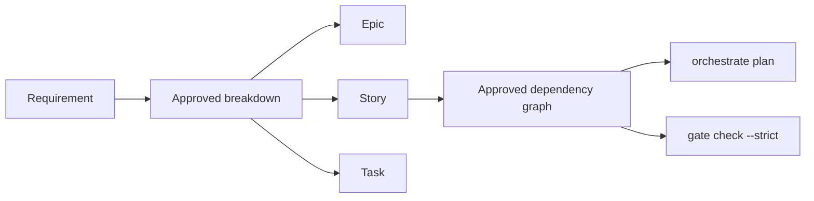

## Output Consistency Layer

Phase and story contracts define what work must happen. Output contracts define the approved shape of durable artifacts produced by that work.

`.sdlc/output-contracts/registry.json` is project-wide and source-of-truth. It stores:

- approved and draft templates by artifact type;
- story to requirement to artifact links;
- reuse, delta, or new output mode;
- user-approved decisions for new templates, structure changes, and justified duplicates.

Before creating a functional analysis, technical analysis, test plan, or similar artifact, an agent resolves the output type for the story. If a related story already covers the same requirement, the default recommendation is `reuse_delta`: reuse the approved base artifact and create only a targeted delta. A new template or incompatible output structure requires explicit user approval before it becomes canonical.

Template approvals store the approved template hash. Output links store fingerprints for the artifact, base artifact, and template. Non-native files also reference an artifact-generator receipt for the exact delivered hash. Verification receipts report container, content, and render dimensions separately; render evidence is distinct from generator attestation. Override decisions are bound to a specific link subject, so the same decision id cannot be reused for a different duplicate output. Each link records the story contract that was current when it was linked (`contract_id`). When several active links match one contract output ref, the links of the current contract win, so a link left by a cancelled delivery does not block the replacement. `output link --supersedes <link-id> --rationale <text>` (human or CI actor) replaces an earlier link of the same story and type explicitly; the earlier link stays in the registry marked `superseded_by` and no longer counts. Registry mutations are serialized with a local lock file to avoid lost updates when multiple chats work in one workspace.

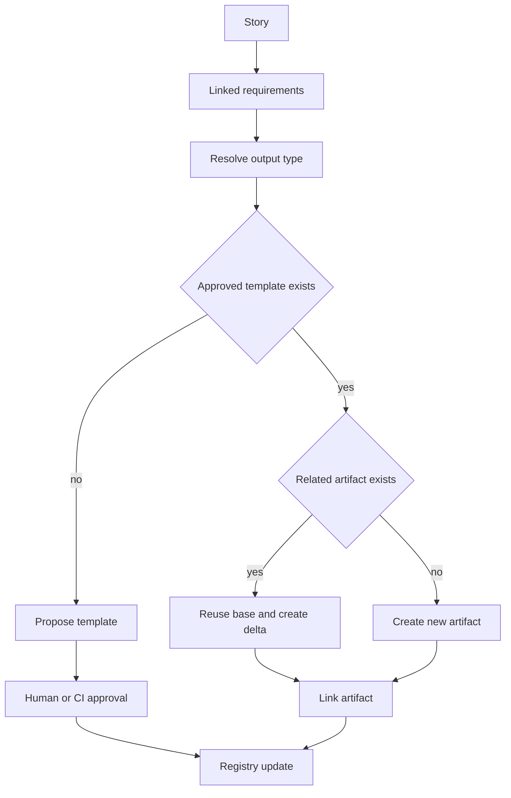

## Change Observatory Presentation Layer

Change Observatory is a read-only projection over canonical project evidence. It is packaged as browser-native assets under `ui/change-observatory/`; no generated bundle, frontend dependency, CDN, telemetry, or hosted component is required.

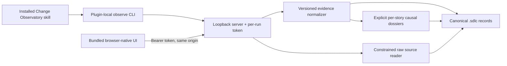

`observe` is dispatched before mutable SDLC workflow configuration is built, so it can diagnose a partial or malformed project without attempting initialization or writes. The launcher resolves assets relative to the installed module, binds only to `127.0.0.1`, selects an ephemeral port by default, and opens a fragment-token URL through shell-free platform commands.

The server pins the device/inode identity of the project and asset roots for the session. `.sdlc` and every requested source component must be non-symlink canonical paths. Raw inspection is restricted to JSON, JSONL, Markdown, and text; cache/index paths, traversal, case-variant policy bypasses, unsupported formats, oversized files, and malformed structured bytes fail closed. Evidence APIs require the per-run bearer capability, while static assets and health remain non-sensitive.

The normalizer emits `change-observatory:view:v1` and preserves `recorded`, `inferred`, `missing`, and `malformed` provenance. Its additive iteration dossier projection joins Asked, Decided, Contract, Done, and Verified lanes only through explicit story, requirement, related-record, contract, and evidence-path bindings. It does not use timestamps, filenames, or free-text similarity; unbound records remain global evidence plus diagnostics. Overview selection is delegated to the configurable policy in `lib/change-observatory/summary-ranking.mjs`, preventing newer operational bookkeeping from displacing more meaningful implementation or approval evidence. Equivalent diagnostics are aggregated server-side and again in the browser model as a defensive boundary.

Optional `trace-narrative:v1` records contain only shareable inputs, outputs, rationale summaries, alternatives, and labeled explanations with `recorded-evidence-only` scope. The rationale remains separate from the generated explanation in the API and UI. Sensitive reasoning keys and narratives explicitly marked as containing private reasoning are removed from both normalized and raw surfaces.

## Local Optimization Layer

`.sdlc/cache/` contains regenerable lookup data such as full-text entries, story-requirement graphs, artifact fingerprints, template resolution, compact KB summaries, dependency graphs, and output resolution results.

Cache entries carry `source_paths`, `source_hashes`, `generated_at`, and `schema_version`. A hash mismatch marks the cache stale. Stale or missing cache is a warning because the CLI can fall back to canonical KB files. A canonical artifact under `.sdlc/cache/` or `.sdlc/indexes/` is a strict gate error because derived files cannot become source of truth. Cached output resolutions are compared with canonical KB resolution before use; if they differ, the CLI asks for `cache rebuild` instead of trusting the cache.

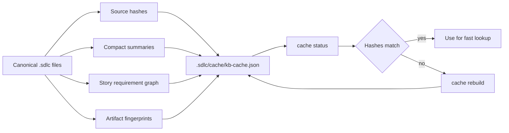

## Parallel Work Model

Parallelism is story-scoped. Each agent or developer claims a story only after its current approved contract is bound by a valid immutable task start, then works on a dedicated branch. The claim is stored in the story folder, while events are appended to a trace log.

For multiple Codex chats, one chat can act as parent orchestrator by reading `orchestrate status --json` and assigning available story lanes. Worker chats verify the story workflow and task-start binding, claim exactly one story, write attributed traces, record push/sync events, and release or hand off their claim when done.

Phase locks are reserved for shared artifacts that cannot be safely edited by multiple story lanes at once. Handoff records capture transfer between analysis, implementation, validation, and release agents.

This avoids one shared mutable planning document becoming a collaboration bottleneck.

### Several computers

A claim file and its `claim.lock` only serialize processes that share one checkout. When the project has a git remote, claims are therefore also recorded on that remote, so two computers can never hold the same story and find out only at merge:

| Ref on the remote | Created by | Meaning |
|---|---|---|
| `refs/agentic-sdlc/claims/<story>/<epoch>/claim` | `story claim` | who holds the story: agent, branch, a claimant id for this claim, the approved contract and task start it is bound to, claim and expiry time |
| `refs/agentic-sdlc/claims/<story>/<epoch>/release` | `story release`, `story complete-step --release-claim`, `story prepare-handoff --release-claim`, `story supersede`/`cancel` of a started story, a takeover | how and when that claim ended (`released`, `transferred`, `cancelled`, `closed` for a superseded or cancelled story, `completed` once the story's delivery is finished, with how it finished, or `taken_over` with who took over and why) |

Each ref is created with a push that the remote accepts only if the ref does not exist yet (`--force-with-lease=<ref>:`), to the remote's fetch address, without hooks or signing, in the C locale, and bounded by `timeout_seconds`. A story is free when its latest epoch has a release (or it has none); claiming it creates the next epoch. Of two computers claiming the same epoch at the same moment, exactly one push is accepted: the other is refused with who holds the story, on which branch, and since when, and writes nothing. `story claim` writes `claim.json` (with the shared record under `shared_claim`) only after the remote accepted the claim.

A story whose latest claim ended as `completed` or `closed` is finished for every computer, even one whose checkout does not have its closing records yet: `orchestrate status` and `status` list it as `closed` and never offer it, `story claim` and `story reserve` are refused with `STORY_COMPLETED_ON_REMOTE`, and only a person may claim it again (`--force --reason`, human or CI actor). Versions before 0.32.0 do not know `completed` and report those records as untrustworthy, so they refuse the claim too. `gate check --lifecycle-complete` warns while the story's final receipt is not on the remote base branch.

Releases are written on this computer first and then shared, so a release that cannot reach the remote only keeps the story reserved for everyone else a little longer; `story release` run again shares it. Taking over a story held elsewhere is a person's decision: `story claim --force --reason <why>` with a human or CI actor, refused inside an agent's session. The takeover is recorded in the release record, so the previous holder's `orchestrate status` and `status` say who took the story over, when, and why.

Every computer keeps the claim records it has seen under `refs/agentic-sdlc-shared/claims/<remote>/` (one view per remote, named by a credential-free fingerprint of its address), fetched without `+` and never pruned; a record that later disappears from or changes on the remote makes that story's shared state untrustworthy, and claiming it is refused until the remote's refs are restored. Pointing the remote elsewhere starts a fresh view instead of reporting every earlier record as gone.

Whether a claim was made here is decided only by an ownership record the claiming worktree writes for itself, `refs/worktree/agentic-sdlc/claims/<remote>/<story>/<epoch>`: git keeps `refs/worktree/` apart for every worktree and never pushes or fetches it. The record holds a random secret; the shared claim carries only its hash (`owner_proof`), so ownership cannot be rebuilt from the public claim record, and copying that record into the ownership refs proves nothing. The record is `pending` from just before the push and `confirmed` once `claim.json` is written; only a pending record without its claim file is treated as an interrupted attempt, while a confirmed claim whose file is missing here (another branch, another worktree) counts as held like any other. A linked worktree on a git that does not keep `refs/worktree/` apart is refused rather than sharing ownership with the others. `claim.json` stays committed with the story's work, because traces and gates bind it as evidence, but it is not proof of ownership: when it arrives on another computer with a checked-out branch, releasing that claim or taking the story over from there is still a person's decision, with `--reason` and a human or CI actor, refused inside an agent's session, and the release record names who released it. Because the ownership record is written before the claim is pushed, a push whose answer is lost is recognised: the CLI lists the remote ref again and keeps the claim if it landed; if the remote cannot be read at all, the refusal says the claim may have reached the remote, and the next `story claim` from this computer releases that interrupted claim as `cancelled` before claiming again. `orchestrate status`, `orchestrate plan`, and `status` read every story's records with one `ls-remote` (and fetch only unseen records) whenever some story is still open. A story another computer holds is listed as `claimed` (or `stale`, once it expires or is older than `orchestration_policy.stale_claim_after_seconds`) and is never offered as an available lane.

`orchestration_policy.coordination` selects where claims live:

| `mode` | With the remote | Without the remote | Remote unreachable |
|---|---|---|---|
| `auto` (default) | shared | kept on this computer, as before | claim refused |
| `required` | shared | claim refused | claim refused |
| `local_only` | kept on this computer | kept on this computer | not contacted |

`remote` (default `origin`) names the git remote and `timeout_seconds` (default 20) bounds each call. A project that is not a git repository keeps its claims on this computer. Claiming is the start of work, so an unreachable remote refuses the claim with a plain explanation; `local_only` is the escape for a project worked on from one computer only. Projects without the `orchestration_policy` block use these defaults. The plugin's hooks refuse forging, deleting, or rewriting these refs by hand.

#### Reserving a story that cannot start yet

`story reserve --id <story> --agent <name> [--expires-in <90m|12h|3d|1w>] [--expires-at <ISO time>] [--branch <planned-branch>]` books a story before it can start, for example while its dependencies are not satisfied. It needs no task start and no satisfied dependency, and it writes nothing in the project (no `claim.json`, no trace). It fixes no starting point, so the delivery perimeter and its base stay those of the later `task start`.

A reservation is a shared claim record marked `"reservation": true`, stored in the same create-only refs as claims: `refs/agentic-sdlc/claims/<story>/<epoch>/claim`, with `contract` and `task_start` set to null. Older plugin versions read it as an ordinary claim, so they also refuse to claim the story.

Ownership of a reservation belongs to the computer (the clone), not to one worktree. It is kept in `refs/agentic-sdlc-local/reservations/<remote>/<story>/<epoch>`, never pushed or fetched, and visible to every worktree of that clone.

On other computers, `status` and `orchestrate status` show "reserved by X until Y". A reserved story that is blocked stays `blocked`; an available story reserved elsewhere is listed as `claimed` and is never offered as available. Their `story claim` is refused with `STORY_CLAIM_HELD_ELSEWHERE`, and so is their `story reserve`. A person can take the story over exactly like a claim, with `story claim --id <story> --agent <name> --force --reason "<why>" --actor-type human` in their own terminal (refused inside an agent session).

On the reserving computer, `story claim` (run after its `task start`) turns the reservation into the claim: the reservation epoch gets a release record with status `transferred`, and the claim takes the next epoch. `story release --id <story>` on a story with only a reservation ends it; a reservation made on another computer needs a person and `--reason`, as for claims.

A reservation always expires. The default is `orchestration_policy.reservation.default_expires_in_seconds` (86400) and the maximum is `orchestration_policy.reservation.max_expires_in_seconds` (2592000). An expired reservation ends by itself: the story is free again without a takeover, `status` notes "the reservation by X expired at Y", and the next claim or reservation records its release with the reason "the reservation expired".

`story reserve` is refused with `STORY_RESERVE_NOT_SHARED` when claims are not shared (no remote, or `coordination.mode` is `local_only`), and when the remote cannot be reached.

#### Work on the remote that nobody claimed

For a story nobody claimed or reserved (state available or blocked), `status`, `orchestrate status`, and `story availability` look at the remote-tracking branches, after the fetch of `status`, for a branch whose name names the story id and that has commits not yet on the base branch. The base branch is `orchestration_policy.merge_drift.base_branch`, or the remote's default branch. Letters and digits do not continue the id, so `ST-1` does not match `ST-10`, and a longer id wins over a shorter one it contains.

With `pull_requests: github-cli`, open pull requests whose title or head branch names the story are also read through the GitHub CLI (`gh pr list`), when it is installed and signed in; a failure becomes a warning note. This is an optional provider adapter; git is the base.

The result is a plain-language warning, for example "ST-REPLAN-002 is not reserved, but the remote has the branch feature/ST-REPLAN-002 updated 20 minutes ago: someone may already be working on it." It never blocks; the decision stays with the person. The JSON field is `unclaimed_remote_work` in `status` and `orchestrate status`.

| `orchestration_policy.unclaimed_remote_work` | Values | Default |
|---|---|---|
| `mode` | `git`, `off` | `git` |
| `pull_requests` | `off`, `github-cli` | `off` |
| `recent_within_seconds` | `null` or 60 to 31536000 | `null` |

#### Checking a story before starting it

`story availability --id <story> [--json]` is read-only: it only updates the remote-tracking branches with a fetch, unless status sync is off (`orchestration_policy.status_sync.mode: off` or `AGENTIC_SDLC_STATUS_SYNC=off`). It returns a `verdict` (`free`, `claimed_here`, `reserved_here`, `reserved_elsewhere`, `claimed_elsewhere`, `finished`, `remote_work_without_claim`, or `untrustworthy`), `safe_to_start` (true only for `free`, `claimed_here`, and `reserved_here`), and the details: `holder`, `expired_reservation`, `completed`, and `remote_work`. Run it right before `task start`.

#### Split the work across machines, step by step

1. **Publish the approved specs.** On the first computer, approve the requirements, story breakdown, contracts, and task starts (each story ready to claim), commit `.sdlc/`, and push the branch everyone starts from (for example `main`). Keep `orchestration_policy.coordination.mode` at `auto` (or `required`).
2. **Pull on every computer.** Each computer clones or pulls that branch, so all of them read the same stories, contracts, and dependency graph.
3. **Pick a free lane.** On each computer, run `agentic-sdlc orchestrate status --json` (or `orchestrate plan --json`). Stories claimed on any computer show as `claimed` with holder and branch; hard dependencies keep blocked stories out of the `available` list.
4. **Check, then claim at the start of development.** Run `agentic-sdlc story availability --id <story> --json`; if `safe_to_start` is false, stop and ask the person before going on. Then run `task start` and `agentic-sdlc story claim --id <story> --agent <name> --branch feature/<story>` at the start of development, not at integration time, so the shared claim protects the work from the first moment. If another computer won the race or already holds it, the command says who and where; pick another available story. When the story cannot start yet, book it with `story reserve` and claim it later from the same computer.
5. **Branch and work.** Create the story branch, implement, record traces and steps, and push the branch.
6. **Open the pull request.** Deliver the story through its own pull request or local release, as the delivery profile says.
7. **Release or hand off.** When the story is complete or handed to another computer, release the claim (`story release`, or `--release-claim` on `story complete-step` / `story prepare-handoff`). If the release says it was not shared, run `story release --id <story>` again once the remote can be reached.
8. **Stale work.** A claim that expired or exceeds the configured age shows as `stale`. Ask its holder to release it; only a person may take it over, with `story claim --id <story> --agent <name> --force --reason "<why>" --actor-type human` in their own terminal.

For phase-by-phase examples, see [Agent Interactions](agent-interactions.md).

## Gate Model

Gate checks are mechanical validations over `.sdlc/` artifacts. They do not replace human judgment, but they catch missing contracts, missing acceptance criteria, incomplete traceability, stale claims, invalid statuses or expiry dates, missing or drifted requirement/delivery profiles, delivery levels above their ceiling, authorization reuse across deliveries, unapproved or changed output templates, unjustified duplicate outputs, stale cache warnings, unclean secret scans, unreviewed pull-request merges, and test/release evidence gaps. Use `gate check --out <path>` to persist JSON or Markdown reports under `.sdlc/reports/`.

### Validation test evidence

`gate_policy.validation_requires_test_trace` decides whether a story in the
validation phase must show that its tests ran. The flag is read from the
effective project configuration and is enabled unless a project sets it to
`false`; the check then appears in the gate report as `validation test evidence
for story <story-id>`.

Two levels of evidence satisfy the flag:

| Recorded evidence | Gate result |
|---|---|
| No passing `test` trace event | Error: the story is in validation with no passing test trace. |
| A passing `test` trace event only | Passes, with a warning naming `test record` as the way to bind the command, exit status, and output. |
| A `test-run:v1` record whose outcome is `passed` | Passes, and the report lists the record as `test run <record-id>`. |

When a test-run record exists, the gate re-reads its evidence files and
compares their hashes against the record: a missing or changed output file
fails the gate, and so does a story left in validation whose latest recorded
run did not pass. Setting the flag to `false` removes the whole check,
including the trace-event error.

Canonical KB and trace paths always use `/` separators so the same records remain stable across Linux, macOS, and Windows. IDs reject names that cannot be represented portably, including Windows device names and trailing periods. Assessment gates validate the baseline/proposal hashes, requirement revision and ceiling, current delivery profile, story/contract lineage, exact authorization-use receipts, generator receipt, required verification dimensions, execution budget/usage/amendments, local smoke/rollback evidence when applicable, and release manifest rather than trusting IDs or a single `passed` flag.

CI selects its matrix by event. Pull requests run Node 24 on Linux, macOS, and Windows (the required `test (<os>, 24)` status checks) plus Linux on Node 18.20.3, the lowest supported runtime. Pushes to `main` run every supported Node line on Linux (18.20.3, 20.12.0, 21.6.0, 24) plus Node 24 on macOS and Windows. The daily schedule and manual dispatch run the complete Linux, macOS, and Windows matrix for every supported Node line. Linux runs the whole suite in one job per Node line. macOS and Windows, the slower runners, run the suite as three parallel shards per operating system and Node line (`test shard (<os>, <node>, <i>/3)`): `scripts/run-test-suite.mjs` reads `AGENTIC_SDLC_TEST_SHARD="<index>/<total>"` and runs one deterministic slice of the sorted test files, so every file runs in exactly one shard; an invalid value is a hard error. The slices are balanced by expected cost: the heaviest file is placed first onto the currently lightest shard (ties by path, then by lowest shard index). The cost of a file is its entry in `test/shard-weights.json` when that table exists (processor milliseconds per file, generated on a quiet machine with `node scripts/measure-test-durations.mjs`; only ratios matter; a file the table does not know counts as the median file), and its size in bytes otherwise, which is the behavior until a table is generated. The source check, runner canary, doctor, and pack dry-run do not depend on the shard, so no shard runs them: one light job per operating system and Node line (`checks (<os>, <node>)`) runs them in parallel with the shards, on the same operating system. A separate aggregator job per operating system and Node line carries the required name `test (<os>, <node>)`. It `needs` the shard jobs and the checks job, runs under `always()` so a failed job cannot turn it into a skipped (passing) check, and queries the run's jobs through the Actions API to require that each of its own three shards and its own checks job, and only those, succeeded; a failed, cancelled, or missing job fails it.

When a pull request or push changes only Markdown at the repository root or under `docs/` (never `skills/`, `commands/`, or any non-Markdown file), `scripts/ci-change-scope.mjs` compares the checkout with the base commit (the pull request base, or the commit before the pushed range) and the heavy steps are skipped on macOS, Windows, and the Linux cells other than Node 24. The `test (ubuntu-latest, 24)` reference cell always runs the full suite, because tests read `README.md` and `docs/`. The jobs themselves still run, so every required and gated check name reports success quickly. Schedule and manual runs never skip, and any doubt (no base commit, a fetch or diff failure, an empty diff) runs the full suite. The skip never counts as release verification: the release gate additionally requires, per cell, that the step proving the suite ran (`Run the test suite`, or `Confirm every shard ran the test suite` for macOS and Windows) concluded successfully, so a docs-only commit cannot be released until a run that executed the suite exists for it. A release tag does not repeat the matrix. Its first job queries the GitHub Actions API and passes only when the CI workflow has a successful `push` run on `main` for exactly the tagged commit that contains six jobs as successful, with the suite actually executed: `test (ubuntu-latest, 18.20.3)`, `test (ubuntu-latest, 20.12.0)`, `test (ubuntu-latest, 21.6.0)`, `test (ubuntu-latest, 24)`, `test (macos-latest, 24)`, and `test (windows-latest, 24)` (the latest attempt of each cell decides; the macOS and Windows cells are shard aggregators, and the gate also requires each of those cells' own shard jobs and checks job to have succeeded and run their steps, so a green aggregator cannot hide a missing or skipped job). It waits up to an hour for a run that is still in progress, allows a short grace period for a run that is not yet registered, and fails closed on a missing run, a failed or cancelled run, a missing, unsuccessful, or suite-skipped cell, or a persistent API error, so a commit that never reached `main` cannot be released. Cells that only the scheduled full matrix produces (for example macOS or Windows on older Node lines) are covered by the daily run and are not part of the release gate. The package job still runs the source check and the policy verification of the packed artifact once. The package regression test creates a real tarball, installs it into a clean prefix, and runs the installed CLI doctor so source-tree success cannot hide a missing packaged resource.

The release workflow parses the tag as complete SemVer; prerelease status comes from the parsed prerelease field, so uppercase identifiers and hyphenated build metadata remain valid without turning a stable build into a prerelease. A rerun may recover a draft only when its exact asset inventory, every downloaded byte, sealed source identity, and workflow-run owner all match the newly verified bundle. An already-published matching release is treated as an idempotent success. Publication is bounded by client and convergence timeouts, and both the pre-publication and final server state are byte-verified before the workflow succeeds.

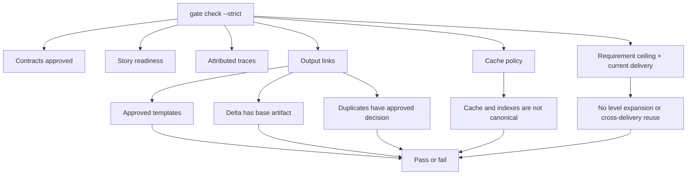

## Extension Points

The CLI accepts a custom template directory through `--template-dir`. Teams can replace the SDLC phase configuration without changing the plugin code.

`autonomy_policy` is also project-local configuration: rollout mode, allowed levels, legacy ceiling, host-verification requirement, delivery kinds, preset checkpoints, and exception triggers are data rather than product-specific branches. The evaluator remains generic and consumes the configured policies plus hash-bound records.

The schemas can be used by CI, pre-merge checks, or future MCP tools.

For the full project knowledge base layout, see [Knowledge Base Structure](kb-structure.md).
