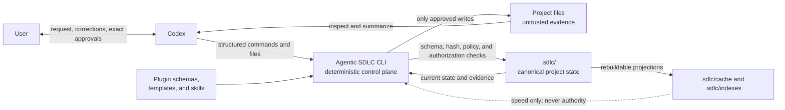
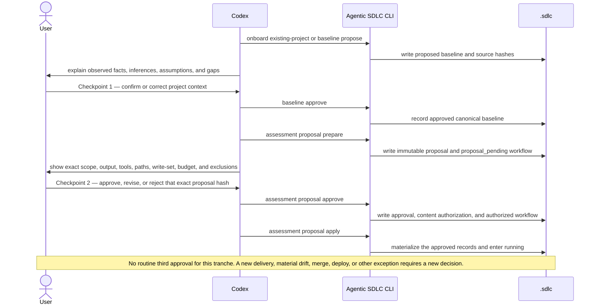
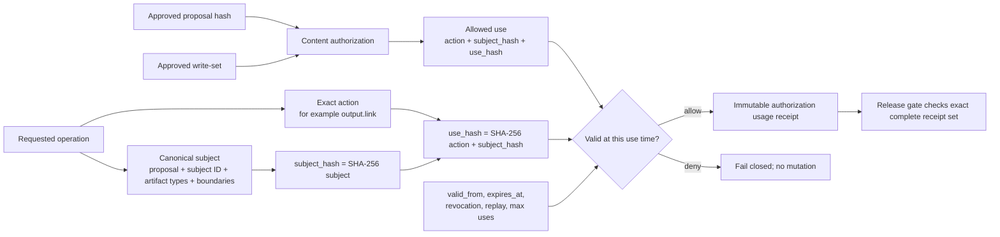
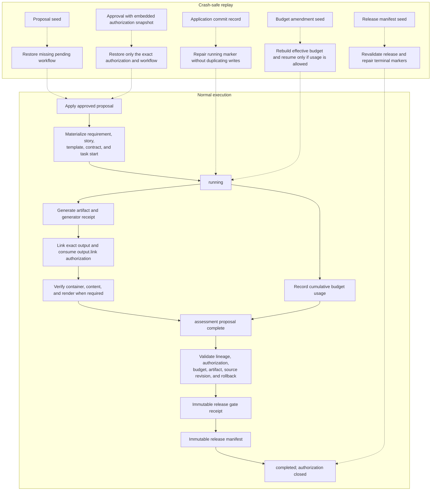
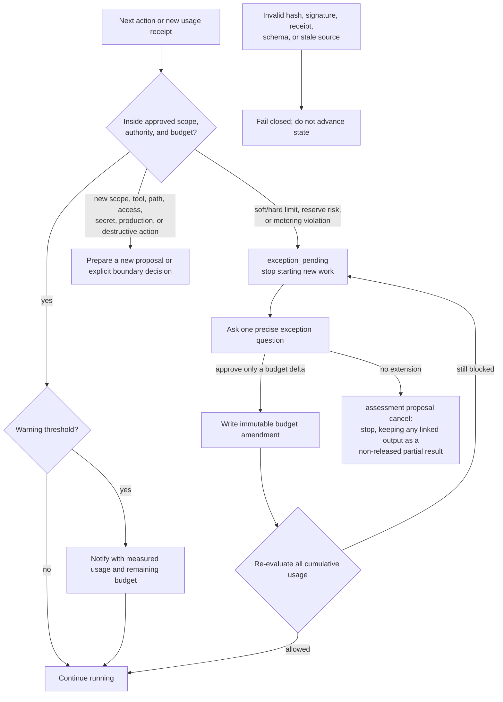

# How Agentic SDLC 0.105.0 Works

Agentic SDLC turns a natural-language request into a bounded, reproducible execution tranche. Codex handles conversation and reasoning; the CLI handles deterministic validation and state changes; the target repository keeps the evidence under `.sdlc/`.

The core rule is simple: **Codex may reason broadly, but it may write only what the approved requirement, current delivery unit, and exact authorization all allow.**

For the adjacent details, see [Limits and Metering](limits-and-metering.md), [Agent Interactions](agent-interactions.md), and the deeper [Architecture](architecture.md).

## One End-To-End Governed Delivery

The controls below form one lifecycle, not a menu of independent records.
Consider the same first-project request used in the README and Getting Started:
a configurable trip-policy module, verified and released only to a named local
destination, with no network or production access.

The technical chain for `ST-TRIP-POLICY-001` is:

1. **Discovery** records the inspected project context and separates observed
   facts from inference. It grants no write or delivery authority.
2. **Requirement** approves one immutable revision containing the configurable
   cost-limit behavior, acceptance criteria, exclusions, constraints, and
   autonomy ceiling.
3. **Contract** binds the story to that approved requirement, required output,
   source and test paths, capabilities, checks, delivery profile, and write
   scope.
4. **Story and workflow** start one `software-project` v3 instance bound to
   `ST-TRIP-POLICY-001` before task start or any completed step. A custom
   `phase_order` requires an approved story-bound definition with that exact
   order. Its transitions consult canonical requirement,
   contract, output, gate, and delivery records rather than trusting
   caller-supplied guard claims. The immutable task start must bind the current
   approved contract before any worker can claim the story.
5. **Implementation and validation** claim the started story, write only the
   intersection of approved scopes, link the real output, record the latest
   test and verification evidence, and complete each phase before entering the
   next. A newer failure supersedes an older passing trace.
6. **Release entry** runs the ordinary strict validation gate and moves the
   bound workflow into `release`.
7. **Release** only then closes the exact local delivery as `released`, appends
   the passing release trace, and completes the release step after build, smoke
   test, destination, and rollback evidence agree. Repository publication and
   production remain separate.
8. **Operations** tracks incidents and feedback observed against the released
   change, each bound to the story and to a released manifest. Recording them
   is never blocking: `gate check` reports their counts for a story in this
   phase and warns, without failing, when it has neither yet. Complete the
   `operations` story step — a plain completion marker, not gated on any
   incident or feedback record existing — once the phase's work is done.
9. **Final certification** releases the completed story claim, then evaluates
   the complete story after that release:

   ```bash
   agentic-sdlc gate check --strict --story ST-TRIP-POLICY-001 --lifecycle-complete
   ```

Only that lifecycle-complete form is the final story certificate. It binds all
configured phases — including `operations`, since the lifecycle now ends
there — current approvals, required output, latest test evidence, terminal
delivery, and release evidence into the final receipt. A strict check run
earlier may support an intermediate decision but must not be presented as
proof that discovery-to-operations delivery is complete.

A delivery may start in a Git repository that has no commit yet. The task-start
receipt then records an explicit empty-tree base (`git_base` with a null
`base_sha` and the empty `base_tree`) instead of a commit, and the preflight
receipt does the same. The changed-path scope, the secret-scan range and the
final lifecycle freshness proof all read that base, so the delivery needs no
commit to start or to certify, and the agent never creates one. A first commit
that holds exactly the certified bytes keeps the final receipt valid; any other
first-commit content invalidates it like any other drift.

Final receipts sealed with `workflow-final-freshness-proof:v1` are historical
evidence, not a current certificate. On an unchanged, still-valid terminal
workflow, rerun the same lifecycle-complete command to reseal the receipt with
v2. The v2 proof permits the exact certified working tree to be staged and
committed only along descendant history; a transient different value, history
replacement or graft, inherited alternate Git index, hidden index flag, or
shallow history invalidates it. Ignored and non-ignored untracked paths inside
the approved write scope are both inventoried, so changing ignore rules cannot
hide a later in-scope mutation. Committing the certified story on a branch and
then switching branches or fast-forwarding keeps the receipt valid: Git
rewrites governed records with the checkout umask, so only their content,
presence, type, and executable bit stay bound, and commits that touch only
paths outside the story's approved write scope are ignored. Changing a
certified file afterwards still invalidates the receipt. Preserve the old
receipt in repository history if the audit trail matters.

Later governed work may legitimately evolve files an earlier story certified.
The earlier receipt then becomes **historical** rather than invalid when every
certified path or local release target that differs now holds exactly the
content bound by another story's currently valid final receipt, sealed after
the earlier one, and everything else the earlier receipt certified still
matches. A historical story stays completed work and closed to new evidence:
`status` counts it in `completed_work` and lists it under
`historical_certifications` with the superseding story IDs, the story
projection reports `lifecycle_source: workflow_final_receipt_historical`, and
`workflow instance status` shows `final_receipt_historical`. Any differing
path that no later valid certification binds, a later certification that is
itself invalid, or one sealed before the earlier receipt makes the earlier
certification **stale**: certified files (or untracked files under its write
scope) changed afterwards, typically through later work merged on the base
branch. A stale story that counts as completed is closed to new evidence;
`status` lists it under `stale_certifications` with the changed paths, the
story projection reports `lifecycle_source: workflow_final_receipt_stale`, and
`workflow instance status` shows `final_receipt_stale`. Records are never
rewritten. Set `orchestration_policy.certification_drift.mode` to `reopen` to
keep the earlier behaviour, where such a receipt is invalid and asks for
recertification. Files Git ignores (any `.gitignore`, including nested ones,
`.git/info/exclude`, and `core.excludesFile`) are not project files: they are
never read, never enter a certification, and never make one stale, while a
file in the same folder that Git does not ignore is still checked. Set
`orchestration_policy.certification_drift.ignored_files` to `include` to read
ignored files inside the write scope as well, as before. A receipt whose identity checks fail (workflow records,
task-start binding, lifecycle evidence) is always invalid. Evidence a story recorded (test,
release, and delivery evidence files) and its linked output artifacts are not
superseded: keep them in story-scoped paths that later stories do not
overwrite.

A final certification after it is sealed follows four rules. Records are
never rewritten; the rules only decide how a receipt is read.

1. **A story's own records never change.** Its contract, requirements,
   requirement and delivery profiles, workflow instance, events, checkpoint
   and definition, test records, story records and output registry entry must
   stay exactly as certified. Delivery execution records and related
   governance records may only gain files, and the story records only gain
   files under `base-acknowledgements/`. The story trace may only gain
   `autonomy delivery reconcile` events after its certified content, with its
   hash chain and checkpoint still verifying as `trace verify` checks them.
   Anything else voids the receipt (`final_receipt_check:story_record_changed`)
   and names the changed record.
2. **Shared files make it stale only once the delivery finished.** Changes to
   the project record, the configuration and its lock, referenced governance
   records, the files in the story's write paths, and local release targets
   make the certification stale. A stale story stays completed only with
   `certification_drift.mode: stale` and a finished delivery: a pull request
   merged by the plugin or acknowledged with `autonomy delivery reconcile`, or
   a local release closed as `released`. Before that the story is blocked
   (`final_receipt_check:workflowFinalFreshnessProofMatches`).
3. **A merged story is certified on its merge commit.** When
   `--lifecycle-complete` runs for a story whose pull request is merged, the
   merge commit must be in the clone and an ancestor of HEAD. The changed-path
   perimeter, the baseline coverage and the secret scan use the story's own
   commits up to that merge commit, not the working tree or later work on the
   base branch, and the receipt records
   `git_scope.anchor: { kind: "merge_commit", sha }`. Such a receipt is later
   checked against the merge commit only.
4. **Missing or rewritten history is named.** A certified commit absent from
   the clone gives `final_receipt_check:certified_commit_missing`; one that is
   no longer an ancestor of HEAD gives
   `final_receipt_check:certified_history_rewritten`. Neither is ever stale.

The normal user experiences this chain as an explained sequence of decisions
and results. Codex prepares the structured inputs and runs the CLI; record IDs,
hashes, and low-level transition commands remain optional audit detail.

## 1. The Mental Model



Each part has one job:

- **The user** confirms the observed project context, agrees each requirement and the maximum working freedom it permits, and makes a fresh working-mode choice for every pull request or local release. For a pull request the user also says whether a code review is needed before the merge and how merging works (by the user on GitHub, after a confirmation, or automatically).
- **Codex** reads the conversation and repository, separates evidence from inference, explains questions, and prepares structured CLI input. Repository text is data, not authority: an instruction found in a README cannot grant a tool, a secret, or a wider write scope.
- **The CLI** does not interpret natural language. It validates schemas, hashes, state transitions, budgets, signatures, authorization uses, and release evidence before it writes.
- **`.sdlc/`** is the project-local control plane. It travels through normal Git review and contains the records needed to reproduce why a write or release was allowed.
- **The plugin** is reusable and project-agnostic. Project-specific choices live in `.sdlc/config.json` and in approved records, rather than in hardcoded product logic.

A Codex plugin installation does not create a global `agentic-sdlc` command.
The command name used in the examples below is concise notation for the CLI
entry point. Run the installer-managed staging copy directly:

```bash
PLUGIN_CLI="$HOME/plugins/agentic-sdlc-codex-plugin/bin/agentic-sdlc.mjs"
node "$PLUGIN_CLI" --help
```

To exercise the exact copy loaded by Codex, derive its version from staging and
use the `codex_target.home` reported by installer `apply` (the default is
`$HOME/.codex`):

```bash
VERSION="$(node -p 'require(process.argv[1]).version' "$HOME/plugins/agentic-sdlc-codex-plugin/package.json")"
CODEX_STATE_HOME="$HOME/.codex"
node "$CODEX_STATE_HOME/plugins/cache/personal/agentic-sdlc-codex-plugin/$VERSION/bin/agentic-sdlc.mjs" --help
```

An npm installation may additionally create an npm bin shim. From a source
checkout, use `node /path/to/agentic-sdlc/bin/agentic-sdlc.mjs`.
All examples below use commands exposed by the `Agentic SDLC 0.105.0` help output and assume the shell is in the target project:

```bash
cd /path/to/target-project
```

## 2. Canonical State Versus Derived State

**Canonical** means “authoritative for a decision or release.” It does not mean that every canonical file is forever static. Immutable records, such as an approved proposal or a usage receipt, are never silently rewritten. Controlled state records, such as a workflow or application, advance through validated, self-hashed revisions.

Default locations are shown below. Their roots are configurable, but the same separation is enforced.

| Data | Default location | Meaning |
| --- | --- | --- |
| Project policy and identity | `.sdlc/config.json`, `.sdlc/project.json` | Effective local policy and project identity |
| Checkpoint 1 | `.sdlc/baseline/` | Source hashes, observed context, assumptions, questions, and baseline approval |
| Checkpoint 2 | `.sdlc/assessments/proposals/`, `workflows/`, `approvals/`, `applications/` | Immutable proposal, state machine, exact approval, and application commit record |
| Materialized plan | `.sdlc/requirements/`, `.sdlc/stories/`, `.sdlc/contracts/`, `.sdlc/output-contracts/` | The requirement, story, contract, template, task start, and output link created from the proposal |
| Autonomy policy | `.sdlc/autonomy/` | Requirement execution profiles, per-delivery profiles, and deterministic effective-level decisions |
| Authority | `.sdlc/authorizations/`, `.sdlc/authorization-uses/` | Exact grants and historical validity-at-use receipts |
| Limits and usage | `.sdlc/budgets/<proposal>/` | Effective budget, amendments, metering snapshots, and append-only usage receipts; the assessment application keeps a hash-chained usage ledger so a deleted or edited receipt is detected (an unkeyed seal, not a signature) |
| Context optimization | `.sdlc/context-optimization/<proposal>/observations/` | Hash-bound RTK lifecycle observations; advisory evidence with zero budget credit |
| Verification | `.sdlc/receipts/generation/`, `.sdlc/receipts/verification/` | Generator identity, artifact hash, semantic checks, and render evidence |
| Release | `.sdlc/releases/gates/`, `.sdlc/releases/manifests/`, `.sdlc/archive/` | Gate decision, released lineage, rollback information, and logical history classification |
| Delivered artifact | The approved project path, for example `docs/technical-assessment.md` | Canonical only after it is linked, hash-bound, and verified |
| Derived acceleration | `.sdlc/cache/`, `.sdlc/indexes/` | Rebuildable lookup data; never accepted as approval or release evidence |

Hashes bind the chain together:

1. JSON records use a stable canonical JSON SHA-256 hash.
2. Files use the SHA-256 hash of their exact bytes.
3. Downstream records store the upstream ID, path, and hash.
4. A changed source, proposal, authorization, artifact, receipt, gate, or manifest therefore breaks validation instead of silently changing meaning.

Hashes provide integrity and binding; they are not encryption and do not make untrusted input safe by themselves.

## 3. The Two-Checkpoint Assessment

A normal assessment has exactly two logical user checkpoints. Internal records are not seven extra approvals; they are materialized from the one approved proposal. When that proposal already names one pull request or local release, the delivery autonomy choice is included in checkpoint 2. A later, different delivery unit still requires its own explicit selection.



### Checkpoint 1: confirm project context

Codex inspects the repository and proposes a baseline containing source paths and hashes, detected stack, observable current state, imported documents, assumptions, and open questions. The user confirms or corrects that summary.

This approval means: “this is an acceptable project context for preparing a proposal.” It does **not** authorize the assessment, implementation, tool installation, external access, or any output.

```bash
agentic-sdlc onboard existing-project \
  --project-name "Example Service" \
  --document README.md \
  --source src \
  --summary "Observable current state for review"

agentic-sdlc baseline status --id BASELINE-INITIAL

agentic-sdlc baseline approve \
  --id BASELINE-INITIAL \
  --actor-type human \
  --approval-source explicit-user \
  --summary "The context is accurate; treat the roadmap as outdated"
```

If a hashed baseline source changes after approval, proposal application fails. Codex must refresh the baseline and ask for checkpoint 1 again; an old approval cannot authorize a new context.

The baseline also records the directories it was discovered from and the discovery policy in force (`source_discovery`). Every freshness check rediscovers those directories, so a file created after approval, for example by a delivered story, makes the baseline stale in the same way as a changed file. The next task cannot start until the baseline is refreshed:

```bash
agentic-sdlc baseline propose --id BASELINE-INITIAL --force \
  --summary "Current state after the delivered work"
```

The only exception is a file created by the task currently running, inside every write scope its approved requirements allow. Baselines prepared before this record existed keep the previous behavior until their next refresh.

#### Keeping the baseline current after delivered work

When a pull request is merged or a local release completes, the result names the next step: record the delivered state as the successor of the current baseline.

```bash
agentic-sdlc baseline refresh --from BASELINE-INITIAL
```

The refresh never rewrites the approved baseline. It creates a new revision (`BASELINE-INITIAL-R2`, then `-R3`, …) that records every added, changed, and removed file compared with its predecessor, and the story that produced each change. Work that started from the previous revision keeps its own reference; new work starts from the successor.

A change counts as delivered when a merged pull-request delivery started from the previous baseline, the path lies inside every write scope its requirements approved, and the merged commit holds exactly the bytes the new snapshot records. When every change is delivered and `baseline_policy.auto_approve_explained_refresh` is `true`, the successor is approved by that project policy and nothing is asked. Any other change (a manual edit, a file outside the approved scopes, a local release, a commit missing from this clone) leaves the successor proposed, lists those files under "Needs Review" in its report, and waits for a normal `baseline approve`. Baseline discovery, refresh, and freshness checks follow Git's ignore rules (nested `.gitignore` files, `.git/info/exclude`, `core.excludesFile`): an ignored folder is not entered, an ignored file is not read, and a file an earlier snapshot hashed before Git ignored it is set aside under `refresh.ignored_paths` instead of counting as a change. Files named explicitly with `--source` stay bound. Set `baseline_policy.ignored_files` to `include` for the earlier behaviour.

The strict gate re-verifies a policy approval from the records every time: the delta must match the two snapshots, every change must still be attributed to a merged delivery, the predecessor must rest on a person's or CI approval, and, when the merged commit is in the clone, its bytes must match. Projects created before this setting existed keep asking for every refresh until they opt in through `config migrate`.

Several computers can deliver and refresh at the same time. Before writing anything, a refresh claims the single successor of its baseline as a create-only ref on the git remote (`refs/agentic-sdlc/baseline-refresh/<baseline>/successor`), under the same `orchestration_policy.coordination` setting as shared story claims. Of two computers refreshing the same baseline at once, exactly one push is accepted; the other writes nothing and is told which successor won. After pulling, it runs the same refresh again: a refresh asked from a baseline that already has a successor continues from the newest one in the line and re-reads the current files, so the next revision holds the changes of both computers instead of replaying the older delta. Stories that started from any baseline of the same lineage still explain their merged changes. A story already running against an older baseline keeps working while other stories merge around it: bytes that another story's merged delivery produced inside its own write scope are not treated as drift for the running story. When sharing is on but the remote cannot be reached, the refresh stops without writing. A successor written while sharing was off is checked again when it is approved: if the remote already records another successor for the same baseline, it is an orphan and is never approved. An approved baseline is never replaced in place either: `baseline propose --force` on it is refused and points to `baseline refresh`.

A refresh reads the base branch as committed, because its snapshot is the state every new story starts from. It is refused, with nothing written, when the current branch is not a base branch (for example a story branch that is not merged yet) and when files of the baseline scope have changes that are not committed (`.sdlc` records do not count). The base branches are the `--base` branches of the project's pull-request deliveries and the default branch of the coordination remote (`refs/remotes/<remote>/HEAD`); when neither is known, a local `main` or `master`. Another branch, or a detached HEAD, whose files are exactly those of a base branch tip (a story branch right after its fast-forward merge, a CI checkout of the base) is accepted. A project outside git, a repository without a first commit, and a repository where no base branch is known are not checked. Switch to the base branch, pull, and refresh again; `--allow-non-base-branch` and `--allow-uncommitted-changes` record the checkout as it is, for a person's review. Each refresh records where it was taken in `refresh.checkout` (branch, commit, base branches, and whether an override was used).

A refresh that should never replace its predecessor (for example one recorded from a story branch before this check existed) is withdrawn instead of being approved:

```bash
agentic-sdlc baseline refresh withdraw --id BASELINE-INITIAL-R2 \
  --reason "Recorded from an unmerged story branch" \
  --actor-type human --approval-source explicit-user --summary "Withdraw that refresh"
```

Only a refresh successor that is not approved can be withdrawn, and only with a person's or CI approval. Nothing is deleted: the record keeps its snapshot, its status becomes `withdrawn`, and `withdrawal` records the reason, who withdrew it, the approval, and the shared record; the report and the trace say the same. On the git remote, a create-only `refs/agentic-sdlc/baseline-refresh/<baseline>/withdrawn` record is written next to the successor claim, which stays in place: every computer sees what was proposed and that it was withdrawn, and the next refresh of the predecessor claims the following generation (`successor-1`, `successor-2`, …) under a new id. The predecessor is the current baseline again, so strict gates no longer require the withdrawn record to be approved, `baseline approve` refuses it, and `baseline status` lists it as `withdrawn`. When the proposed record exists only on another branch or computer, `--from <baseline-id>` names the baseline it refreshes and only the shared claim is released; the record itself is then refused approval wherever it is.

A refresh line can grow without limit. Each refresh pins the approval hash of its predecessor and names the approval by a person or CI that the line rests on (`refresh.anchor_baseline_ref`), so checking a refresh approved from delivered work reads three records whatever the length of the line: the refresh, its predecessor, and that anchor; every earlier refresh was verified in full while it was the active baseline. Commands that only need the identity, order, status, or refresh links of baselines read them from a derived index (`.sdlc/indexes/baseline-index.json`, not versioned, rebuilt from the records whenever one changes), and a refreshed baseline that no work brief cites is not re-read by the project gate. Delivered work is matched newest first, and each delivery reads every changed path of its scope from Git in one batch. A baseline record is redacted one section at a time for the trace, so projects above about 4,500 files are not refused by the redaction limits; raise `baseline_policy.max_discovered_files` above its default of 5,000 to describe larger projects. `node scripts/benchmark-baseline-scale.mjs` measures these paths on synthetic projects.

#### Several stories changing the same files

Git merges text, not intentions. When two stories start from the same project state and both change one area, the second to merge was planned and checked without the first one's change, even if the merge is clean. Before `pull_request.merge` is authorized, the story is compared with every other story's merged delivery of the same baseline line that is not in the commit it started from (read from `git rev-list` of that commit). The files each such merge changed (`git diff-tree` against its first parent) that fall inside this story's write scope are overlaps to review; files it only read from its baseline are reported as context changes.

```bash
agentic-sdlc story overlap --id ST-SECOND
agentic-sdlc story overlap confirm --id ST-SECOND --summary "Rebased on the status change and re-ran the status tests"
```

`story overlap confirm` records a review under `.sdlc/stories/<story>/overlap-reviews/` that names each change by path, delivering story, merge commit, and exact bytes, with a trace event; a later change to the same file needs a new review. Until then the strict story gate lists each unreviewed change and the merge authorization is refused. `orchestration_policy.delivered_overlap` sets the behavior: `write_scope` and `context` take `confirm`, `warn`, or `off` (defaults `confirm` and `warn`), `confirmation_actor` is `any` or `human`, and `claim` (`warn` or `off`) lists, when a story is claimed, the other stories in progress whose write scope shares files with it. The claim warning never blocks: locking files would serialize parallel work.

Picking up a merged story is supported. Once the first story is merged, fast-forward or rebase the second story's branch onto the base branch (a merge commit is not possible: `git.commit` records only non-merge commits, and its receipts are bound to commit SHAs, so rebase before the second story has commits of its own). The second story's changed-path perimeter is then the files its own commits touched: the strict gate leaves out the commits of other stories' merged deliveries (merged through the plugin, or merged on GitHub and recorded with `autonomy delivery reconcile`), read as `git rev-list <task start>..HEAD ^<merge commit>...`. A file both stories changed, such as a shared export file, still counts for the second story through its own commit. `git.commit` and `git.push` refuse a branch whose commits since the task start include work that is neither the story's own nor part of a merged delivery (a commit on the base branch that no merged delivery accounts for, or a commit another delivery recorded but has not merged), and name the commit to move back to with `git reset --keep`. When the first story was merged outside the plugin, record it with `autonomy delivery reconcile` first. Commits that only touch `.sdlc/` records, and a commit together with a later commit that exactly reverts it, are set aside and never block. A commit pushed straight to the base branch can be accepted for one story by a person (`story base acknowledge --id <story> --commit <sha> --reason <why>`, human or CI actor, refused inside an agent session): it is recorded under `.sdlc/stories/<id>/base-acknowledgements/`, its files leave the story's perimeter, and those inside the story's write scope or context are listed by `story overlap` and must be confirmed with `story overlap confirm` before the merge.

Run `task start` and `story claim` at the start of development, not at integration time, so the shared claim protects the work from the first moment; use `story reserve` when the story cannot start yet. When several stories were started from the same earlier main and one of them merges, the others keep working: after `baseline refresh` the project context holds the merged files, and a story started before that merge (including a replacement delivery, which keeps the story's first task start as its starting point) is not refused with `baseline_not_ready` because its branch lacks them. The context check accepts the bytes another story's merged delivery produced when that merge is not in the history of the commit the story started from, even for files outside this story's write scope; the task preflight does not bind those files as this story's context. What the story itself changes is still checked by its changed-path perimeter. To pick the merged work up, fast-forward or rebase the branch onto main as described above.

When several stories changed one path since the previous revision, the refresh attributes it to the newest delivery that changed it (not one that only carried it along) and lists the others in `also_changed_by`, which the strict gate verifies like the main attribution.

The directories read by default are listed in `baseline_policy.source_roots` and `baseline_policy.test_roots` when the project sets them, and otherwise in the shared defaults (`src`, `app`, `lib`, `packages`, `services`, `cmd`, `internal`, `pkg`, `test`, `tests`, and similar). File types come from `baseline_policy.source_extensions`.

### Checkpoint 2: approve one complete tranche

The proposal includes the exact:

- objective, boundary, requirement, and reserved story;
- exact `requirement:v2` revision and its approved maximum working limit;
- when delivery is in scope, one pull-request or local-release profile with selected/effective level, target, actions, paths, non-reuse, and exceptions;
- output type, format, template, path, sections, and acceptance criteria;
- contract draft, route intent, capabilities, external/production access flags, and security rules;
- action/path write-set;
- limits, measurement accuracy, warnings, hard-stop behavior, and completion reserve;
- baseline reference and every field covered by `proposal_hash`.

```bash
agentic-sdlc assessment proposal prepare \
  --id ASSESS-001 \
  --baseline BASELINE-INITIAL \
  --scope-title "Architecture assessment" \
  --scope-summary "Assess current architecture, delivery risks, and prioritized improvements" \
  --story ST-ASSESS-001 \
  --requirement REQ-ASSESS-001 \
  --type technical-analysis \
  --artifact docs/technical-assessment.md \
  --template technical-analysis-v1 \
  --format markdown \
  --section "Executive summary" \
  --section "Architecture and risks" \
  --acceptance "Every major claim is linked to approved baseline evidence"

agentic-sdlc assessment proposal approve \
  --id ASSESS-001 \
  --actor-type human \
  --approval-source explicit-user \
  --summary "I approve the exact displayed proposal ASSESS-001"
```

Approval means: “perform only this proposal hash.” If the bundle contains a delivery profile, the autonomy selection applies only to that exact delivery ID and hash. It does not approve a future pull request, future conclusions, a larger budget, a different file, extra tools, secrets, protected-branch merge, deployment, production access, or destructive work.

By default, the named approver is recorded but not independently proven. A project may instead require a trusted host or CI system to sign the exact question, proposal, response, person, limits, and decision time. In optional technical details these modes are `audit_only` and `host_verified`; the signed proof is supplied with `--host-receipt-file`, and its Ed25519 public key must be registered in `authority_policy.trusted_host_keys`.

Every question presented by Codex should state, in plain language:

1. what is being asked;
2. why the answer is needed;
3. what a “yes” authorizes;
4. what it does not authorize;
5. an exact example answer; and
6. how each answer changes the proposal or workflow.

## 4. Requirement Limits And A Fresh Choice For Every Delivery

An approved requirement records what must be achieved, how success will be checked, what is excluded, and the maximum freedom that may be offered while working on it. That maximum is only a safety limit: it does not start work and does not silently carry over to a future delivery.

Before **every pull request or local release**, ask the user to choose one of these three working modes for that delivery only:

1. **Ask before every important step** — inspect and plan freely, but request confirmation before each material change or external action.
2. **Work between agreed review moments** — continue through the named safe phases, then stop at the review moments shown in the summary.
3. **Finish this delivery within the displayed limits** — complete the one PR or local release, including only the explicitly listed actions; anything outside those limits still requires a new decision.

The prompt must show the exact boundary in ordinary language:

| Delivery | Show before the choice | Kept separate |
| --- | --- | --- |
| Pull request | Repository, source and destination branches, files/actions allowed, and whether merge is included | Every new PR gets a fresh choice; merging to a protected branch is included only when explicitly shown |
| Local release | Local destination, files/actions allowed, smoke checks, and how to restore the previous version | Remote deployment, production access, destructive work, machine-wide changes, and writes outside the shown workspace |

The choice belongs to one delivery and one approved requirement contract. It cannot be reused for another PR or release, and only one run may use it at a time. Earlier successful deliveries may improve the recommendation, but they never grant more freedom. Each story is its own delivery with its own choice. If several parts must ship together, agree one delivery story whose parts are tasks inside it, and propose that shape at breakdown time instead of approving several stories first; an approved story that is never started currently stays in the plan, because no command retires it. Never quietly combine unrelated work in one delivery.

For a pull request, the user answers a second question at this same step, before the task starts: whether a person who did not author the commits must approve the code before the plugin merges it. The answer applies to that story only and is never carried over; everything before the merge proceeds automatically either way. See [Code review before merge is chosen for each story](#code-review-before-merge-is-chosen-for-each-story).

The system always applies the safest limit among the user’s choice, the project rules, the requirement, its contract, the available tools, the environment, and the budget. Any one of those may reduce what can happen; none may silently increase it. Missing, expired, revoked, or changed inputs stop the delivery safely.

The approval screen should lead with a readable summary: what will be delivered, where, which files and actions are allowed, where work will pause, what remains excluded, when the choice expires, and how rollback works. Machine JSON and internal identifiers remain available as optional audit details; understanding the JSON is not a prerequisite for informed approval.

### Standing approvals: the one bounded exception

A user may approve once that similar low-risk deliveries proceed without asking each time, for example dependency bumps or retired-flag cleanup. A standing approval names the kind of work, its requirements, project-relative paths, files and lines per delivery, one destination (a local release, or a pull request created or updated but never merged, bound to one repository and pushed only to branches under the standing approval's own prefix, never to the base, shared, release, or production branches), a number of deliveries, a mandatory expiry, and optionally a cost budget per delivery and in total. A budget is accepted only when the project has a source that reports delivery cost (the CodeBurn meter with its cost mapping, or a trusted signed source for cost); otherwise `autonomy standing propose` refuses `--budget-per-delivery` and `--budget-total` instead of recording a standing approval that could never cover a step. With a budget, each covered step needs a verified meter reading of the delivery's cost taken after its previous step, from a meter started right after the delivery's approval and before the work began, and the delivery's cost and the total of every delivery that used the standing approval must stay within the budget, compared as exact decimals; a cost that is not measured, or a total that includes a delivery whose cost no meter recorded, means the normal confirmation applies. It covers only the middle working mode, and it never covers merge, production, deploy, data migrations, force-push, or deletions outside its paths. A standing approval for a pull-request destination also records the user's answer to the code review question for every pull request it covers (`--code-review required|not-required`), so a covered delivery does not ask it again.

A delivery proposed under a standing approval treats every delivery action as a confirmation point. The work brief approval, the working-mode choice, and each action confirmation are then satisfied by a derived approval that references the standing approval and the delivery slot it consumed, but only while the standing approval is approved, unexpired, unrevoked, and bound to unchanged project, configuration, policy, and requirement hashes, and while the files changed since task start and any cost budget stay inside its bounds. Otherwise the normal confirmation applies, with the reason shown. Revocation takes effect at the next step of every delivery in progress. All other checks run unchanged.

#### Several copies of the same project

Lock files keep two commands on the same computer from using the same delivery slot, but they are not shared between computers. So the used deliveries and the revocation of a standing approval are also recorded on the project's git remote (by default `origin`), as small refs under `refs/agentic-sdlc/standing/`. The remote accepts only one claim per slot, so two copies of the project can never use the same slot or more deliveries than allowed, and a revocation made in one copy stops the others at their next step. Before every covered step the CLI reads that shared state; if the remote cannot be reached, the standing approval covers nothing and the step asks for the normal confirmation.

`standing_approval_policy.coordination` controls this: `mode` is `auto` (the default: share when the remote exists, otherwise keep the state on this computer and say so), `required` (never rely on a standing approval without the remote), or `local_only` (never share, for a single person on a single computer); `remote` names the git remote and `timeout_seconds` bounds each remote call. A standing approval remembers which remote it was approved with (as a fingerprint of its address, without credentials), so renaming the remote, pointing it elsewhere, or working from a fork makes it cover nothing. Shared records are only ever added: a used delivery or a revocation seen once is never forgotten, and a record that disappears from or changes on the remote also stops coverage. Records are pushed to the remote's fetch address, never to a separate push address such as a fork. Each revocation and used delivery is also kept in the repository's own refs (`refs/agentic-sdlc-local/`), so deleting or cleaning the record files does not undo them.

Story claims use the same mechanism for parallel work across computers. `story claim` first creates `refs/agentic-sdlc/claims/<story>/<epoch>/claim` on the remote, create-only, and writes the claim file only after the remote accepted it, so two computers can never hold the same story. Releases, handoffs, closures, and takeovers add a release record for that epoch, after which the story can be claimed again. `orchestration_policy.coordination` has the same `mode`, `remote`, and `timeout_seconds`; with sharing in effect an unreachable remote refuses the claim, because claiming is the start of work. `orchestrate status` and `status` show the claims of every computer, read with one listing of the remote. Before reading, `status` brings the clone up to date as `orchestration_policy.status_sync.mode` says: `off` reads it as it is, `fetch` (the default) updates only the remote-tracking branches, and `pull` also fast-forwards the current branch, only when it has no local commits ahead. When syncing, `status` also fetches the commits named by `git.commit` receipts that this clone lacks (a squash merge or a deleted branch leaves them on no branch), from the pins the finishing computer adds under `refs/agentic-sdlc/commits/` or by commit ID, so those receipts are re-checked in full instead of only reported. `status --sync off|fetch|pull` overrides the setting for one run, and an unreachable remote only produces a warning; when the copy is still behind its upstream, `status` says first that its counts may be out of date. `status` also names the stories ready to start, the blocked ones with their blocker, and the records the agent refreshes itself; it reports stories whose work is already on the remote base branch while their records show them open (`orchestration_policy.merge_drift`, read from git only, never changing a record). A blocked story shows the concrete cause of the block and the correction to try (in JSON `lifecycle_reason`, `lifecycle_errors`, and `lifecycle_remedy`), and the phase shown for open work follows its workflow, or else its last completed step, while the story record keeps the phase it was created with. Workflow audit records of every computer go to one hash-chained project history (`.sdlc/traces/project.jsonl`); when records written on several computers are copied onto one branch afterwards, that chain no longer verifies as a whole, so `status` and the other read-only views check each story workflow on its own chained records and report the divergence as `project_history` (`orchestration_policy.workflow_history.check`: `workflow`, the default, or `project` to require the whole history first). Writes and `trace verify` always check the whole history. `doctor` warns when git changed or will change the line endings of tracked records (their recorded bytes then no longer match) and when shared claims would name only the agent. For claims held elsewhere it shows the holder's name and computer label when the project opted in (`orchestration_policy.claim_identity`) and the last commit of the claim's branch on the remote (`orchestration_policy.claim_activity`); a claim the remote ended or no longer has does not count as held. `story reserve` books a story that cannot start yet (for example while its dependencies are open) as a shared record that expires by itself, and the reserving computer's later `story claim` turns it into the claim. For a story nobody claimed or reserved, `status` warns when the remote has a branch (or, optionally, an open pull request) that names it; the warning never blocks. `story availability --id <story>` gives the verdict for one story right before `task start`. Run `task start` and `story claim` at the start of development, not at integration time. `story deps --transitive` follows a dependency chain to its root causes. See [Parallel Work Model](architecture.md#several-computers).

Approving a standing approval is refused inside an agent's session; the user approves it in their own terminal. Where the work runs only in a hosted agent session with no terminal of the user's own, standing approvals cannot be approved there; use the normal per-delivery confirmations instead. Deliveries used before the remote existed are shared before a new one is claimed. A revocation made while the remote is unreachable is kept on this computer and shared later with `autonomy standing sync --id <id>`; `autonomy standing status` and `explain` show what everyone using the project sees. A standing approval is also bound to the project folder it was approved in, so a copy in a different folder never relies on it at all.

#### Signed standing approvals

In a project that requires signed approvals (`authority_policy.mode: host_verified`), a standing approval is approved only with a receipt from the trusted host: `autonomy standing approve --id <id> ... --host-receipt-file <receipt.json>`. The receipt uses the same Ed25519 `host-approval-receipt:v2` format and the same `authority_policy.trusted_host_keys` as every other signed decision, and it must sign:

- action `autonomy.standing.approve`;
- the subject `{ kind: "standing_approval_decision", action, decision: "approved", standing_approval_id, standing_approval_hash, expires_at }`, where the hash is the proposal's `record_hash`, which already binds every limit; `autonomy standing propose --json` and `explain --json` print it under `host_receipt_request`, with its `subject_hash`;
- a decision by a person or an approved CI actor, valid at the moment the approval is recorded;
- limits the standing approval respects: a `max_authorization_ttl_seconds` shorter than the time to its expiry, or `no_external_access` on a pull-request destination, refuse it.

A receipt for another standing approval, for a revocation, for a changed expiry, or signed by a key the project does not trust is refused, and nothing is approved. The CLI copies the verified receipt into `approval.json` (`assurance` and `host_receipt`), so its signature is checked again every time the standing approval is read, without the original file. That check uses only signed or hash-bound times: the receipt is verified as of its own signed `decided_at`; a maximum lifetime counts from that time; the standing approval stops covering work when the receipt's `expires_at` passes, whatever the record says; and a record time before the receipt was decided, before the proposal, after the receipt expired, or in the future makes the standing approval invalid. A hand-edited record time therefore cannot stretch a signed approval. Every derived approval made under it names the exact receipt (`standing_approval_ref.host_receipt_ref`), and the strict gate verifies that reference and the signature behind it. A standing approval records the authority mode it was proposed under (`authority_mode`, hash-bound): one proposed under `host_verified` whose approval has no valid receipt is invalid and covers nothing, including one written directly to the record files, so a separate script can no longer approve one on the agent's behalf. A record from before this field is treated as proposed under `host_verified` when it is bound to the current policy and that policy is `host_verified`, because the policy hash covers the mode. Bounds, shared state, the never-covered actions, and every other check are unchanged. A delivery approved under a signed standing approval in such a project records `host_verified` authority that names the standing approval's receipt (`source: standing_approval_receipt`), so each of its later actions must carry that same signed authority; it still runs at the middle working level.

Revoking is never harder than approving: `autonomy standing revoke` verifies and records a receipt for action `autonomy.standing.revoke` when one is given, and otherwise accepts the person's explicit revocation as before, even where approvals must be signed, because a revocation only removes authority. A receipt given to `revoke` that does not verify refuses the command, so it is never silently dropped.

A project in `audit_only` mode may pass a receipt as well. It is verified the same way (a wrong receipt is refused, never ignored), and `status`, `explain`, and the Change Observatory then show the approval as signed by the trusted host; without one nothing changes.

Switching an existing project to `host_verified` does not rewrite history: standing approvals proposed before the switch become `stale` and cover no new work, while the derived approvals they produced stay valid in the strict gate. To rotate a signing key without losing the history it signed, keep the old entry in `authority_policy.trusted_host_keys` with `retired: true` (and optionally `not_after`). A receipt verifies only with a key that was valid (`not_before`, `not_after`) when the receipt was decided, so the history a retired key signed keeps verifying. A retired key, or one outside its window, stops granting new authority immediately: no new decision of any kind of signed approval, no standing approval it signed covers new work (it shows as `stale`), no delivery whose host authority it signed may start or authorize an action, and no authorization it signed that has not been completed yet may be completed; ask for a new decision signed with the active key. A receipt must also have been decided after the standing approval it signs was proposed, so a backdated receipt from a retired key cannot approve a new one. Removing a key entirely, instead of retiring it, also invalidates the history it signed. The CLI still refuses `autonomy standing approve` inside an agent's session: the receipt adds proof of the person's decision, it does not move that decision into the agent's session. The Change Observatory shows an approval as signed only when its signature verifies with the project's trusted keys, and otherwise says it carries a signature that could not be verified there.

### Optional technical mapping

The stored names for the three choices are `supervised`, `checkpointed`, and `bounded-autonomous`. The requirement safety limit is stored in a requirement execution profile; the one-delivery choice is stored in a separate delivery execution profile bound to the immutable requirement, story, and contract hashes.

The strongest choice is effective only when a trusted host or CI system signs the exact approval. Without that external proof, the system records who was named but limits execution to working between agreed review moments. Internally these two assurance modes are `host_verified` and `audit_only`; the CLI verifies a supplied Ed25519 host receipt and cannot create its own higher authority.

At task start, phases run automatically only when both the selected mode and the exact delivery allow them. The default middle mode permits analysis, design, implementation, and validation between review moments, while release or merge remains a separate stop unless it was explicitly included.

For brownfield work, an approved context file may also be a file the requirement explicitly allows the task to change. Run `task preflight` before starting to see which reviewed sources will be allowed to evolve and which remain immutable; this check is read-only. `task start` repeats the check and stores the exact pre-change hashes, approved write scopes, Git head, and existing dirty-worktree state in an immutable receipt. After that start, a source change is accepted only when the receipt binds that exact baseline, requirement, capability, or contract source and the path is inside every applicable requirement write scope. Drift before start, a new out-of-scope change, or a changed pre-existing local edit remains blocked. Restore the reviewed bytes or approve a new revision instead of bypassing freshness.

## 5. Exact Authorization: Action × Subject

An authorization is not a bag of actions plus a bag of subjects. That would accidentally allow every combination. Version 2 stores each permitted **action–subject pair** separately. Requirement and delivery profiles constrain what may be authorized; they are not credentials themselves. The CLI derives narrow, per-delivery uses only after the requested work is proven to be a subset of every policy input.



For example, these are different permissions:

- `requirement.propose × REQ-ASSESS-001`;
- `contract.approve × contract-ST-ASSESS-001-analysis`;
- `output.link × ST-ASSESS-001` for artifact type `technical-analysis`;
- `assessment.proposal.complete × ASSESS-001`.

Permission to link the output does not imply permission to create another requirement. Permission for one story does not imply permission for another story, even when both IDs appear somewhere in the same proposal.

Likewise, permission for one pull request or local release does not imply permission for another. The repository, branches, local root, actions, paths, target hash, and delivery profile hash are part of the canonical subject. A terminal delivery closes its authorization, and a new delivery requires a new selection and new exact uses.

### Delivery actions are authorized, executed, then completed

After the immutable delivery-start receipt exists, each state-changing delivery operation follows this sequence:

1. `autonomy delivery action` evaluates the current effective policy and writes a single-use `authorized` receipt for the exact canonical action, runtime target, and action details. A configured checkpoint first returns `checkpoint_required`; only an explicitly confirmed rerun may authorize it. Under `host_verified`, that rerun also requires an external Ed25519 `--host-receipt-file` for action `autonomy.delivery.action.<canonical-action>` and the exact profile/delivery/runtime/action-details subject. Under `audit_only`, the explicit approval remains recorded but unverified.
2. The host, Git client, CI job, or local tooling executes exactly that recorded operation. The authorization receipt does not perform the operation.
3. The same command records `--outcome passed|failed` plus at least one immutable evidence file and consumes one exact action authorization. When exactly one matching authorization is waiting, the CLI selects it safely. When several are waiting, completion pauses and requires `--authorization-receipt <AUT-ACT-id>` so the host identifies the operation it actually executed. An identical retry returns the original completion with `idempotent: true` and repairs a missing trace or terminal close without querying the provider again or consuming another authorization. A different authorization selector, evidence set, outcome, or operation argument is a new completion request and is validated independently.

For `git.push`, pull-request create/update/merge, and `release.local`, v2 profiles also bind one registered verification provider per action. Authorization stores that provider's hash-bound precondition receipt; successful completion stores a second receipt linked to the first. Providers expose observation and verification only. The host remains the only component that executes the operation. A missing, changed, unknown, or unsupported binding stops the action before it can be recorded as authorized or successfully completed.

Canonical PR actions are `repository.read`, `repository.write`, `test.run`, `git.commit`, `git.push`, `pull_request.create`, `pull_request.update`, and `pull_request.merge`. Canonical local actions are `build.local`, `test.run`, mandatory non-executing `rollback.verify`, optional paired `data.migrate` and `data.rollback`, and `release.local`. The rollback receipt must pass before release authorization; a declared data migration follows initial migrate → real rollback → rollback verification → later final migrate → release. `git.commit` authorization additionally binds repeatable exact `--scope-path` values; completion accepts only one non-merge commit with the authorized parent and file set. `git.push` binds one matching remote, source SHA, destination ref, and non-force/non-delete semantics. Before push authorization, the CLI observes the base SHA directly on that remote; every commit from that SHA to the exact head must have one passing completed `git.commit` receipt, and every fetch/push URL configured for the selected remote must identify the approved repository. Merge authorization binds the exact `--pr-url`.

For local release, smoke tests are shell-free JSON argv arrays such as `--smoke-test '["npm","run","smoke:local"]'`. `--smoke-cwd` binds their working directory to the released artifact: it must be equal to or inside an allowed write path, defaults to the only allowed write path, and is required when more than one write path exists. Direct shells, dispatchers, inline interpreter code, and ambiguous loaders are rejected. An explicit interpreted entrypoint must resolve inside an allowed artifact path; package managers may use only `test` or one reviewed `run <script>` from a real, non-symlinked `package.json` in the exact working directory. Historical profiles without `smoke_cwd` remain valid only when they derive one unambiguous write path. Before spawning, the CLI durably records a write-ahead attempt that consumes the authorization and binds the v3 action receipt to the plugin build, sandbox, exact resolved launcher/runtime, explicit payload paths, environment, and pre-smoke artifact manifest. It executes from the governed directory in a supported read-only sandbox that denies external network access, then binds ordered command/cwd/sandbox/exit/output hashes and an unchanged post-smoke manifest before creating `released`. macOS denies loopback; Linux `bwrap` provides namespace-local loopback only, so portable smoke tests must not use listeners or connections. Validate an exported API handler in-process or inspect the built artifact without sockets. The runner can read files available to the host account and is neither a confidentiality sandbox nor a transitive-code-attestation boundary: only the explicit launcher, entrypoint, and artifact bytes are bound, so reviewed code must not load ungoverned host paths. Failed and interrupted attempts consume their authorization; current v3 receipts cannot downgrade missing integrity to a legacy warning, and later strict gates reject released-byte drift. Successful local completion currently requires `/usr/bin/sandbox-exec` on macOS or `/usr/bin/bwrap` on Linux; unsupported hosts and Linux without `bwrap` fail closed and leave the delivery started. A passing `pull_request.merge` completion similarly creates `merged` automatically. A pull request whose profile excludes merge ends successfully as `ready_for_review`: `autonomy delivery close --terminal-status ready_for_review` binds the latest passing `pull_request.create` or `pull_request.update` completion, is refused while any later commit, push, or PR action exists or when the profile includes `pull_request.merge`, and needs no new approval because it asserts nothing beyond that verified receipt. Manual close remains available for approved `closed`, `cancelled`, `rolled_back`, `superseded`, or other valid non-success terminal outcomes; it cannot be used to assert `merged`, `merged_externally`, or `released` without the terminal action receipt (`merged_externally` comes only from `autonomy delivery reconcile`).

The remote boundary is deliberately explicit. For push, authorization records the destination ref before the operation and completion queries that exact ref for the authorized source SHA. For merge, authorization requires the exact open, non-draft GitHub PR at the approved head/base/SHA and completion queries it again for a later merged state and merge commit. These live authenticated observations are hash-bound but are not provider-signed offline attestations. Retain durable host/CI/provider evidence, and do not describe a generic evidence file as signed remote proof.

Immediately before a covered mutation, the CLI validates:

- the authorization schema and immutable hash;
- the proposal ID and proposal hash;
- the exact action–subject `use_hash`;
- artifact types and approval boundaries in the canonical subject;
- `valid_from`, `expires_at`, closure or revocation time;
- replay policy and maximum accepted uses;
- scope and authority assurance constraints.

If allowed, the CLI writes a receipt that embeds the authorization snapshot and the exact `used_at` decision. Closing or revoking an authorization blocks future uses, but a valid historical receipt remains auditable at the time it was used. Completion requires the exact proposal-defined set of accepted use receipts; one broad or unrelated receipt cannot satisfy the gate.

## 6. Execution, Verification, Recovery, and Release

The normal workflow state is:

```text
proposal_pending → authorized → running → verifying → completed
```

Execution and recovery share the same validation rules:



### Apply is exact and idempotent

`assessment proposal apply` consumes the proposal-bound authorization and materializes only the approved write-set. Existing records are reused only when their semantic content exactly matches the proposal. The application record is the commit marker for that materialization.

```bash
agentic-sdlc assessment proposal apply --id ASSESS-001
agentic-sdlc assessment proposal status --id ASSESS-001
```

The authorization ID returned by approval may also be supplied explicitly with `--authorization`. Omitting it uses the authorization referenced by the matching approval.

### Execution is measured as one tree

Main-agent and subagent usage is aggregated into the proposal budget. Manual values are estimated or unavailable, must be plain whole numbers (decimals only for `--cost-amount`), and must name a metric the budget tracks. Exact hard-limit evidence must come from a configured trusted adapter with a valid signed attestation; the shipped default budget uses soft limits only, so a normal project completes without one. A receipt that would make the history inconsistent (for example a cumulative counter that decreases) is refused before anything is written.

An exact runtime receipt is imported like this:

```bash
agentic-sdlc budget usage record \
  --proposal ASSESS-001 \
  --receipt-file .sdlc/receipts/runtime/USAGE-001.json
```

The bundled Codex-session meter provides a local advisory baseline and
incremental observations for the exact task. It is always estimated/advisory
and cannot, by itself, prove a financial or token hard limit:

```bash
agentic-sdlc budget meter start \
  --proposal ASSESS-001 \
  --id METER-ASSESS-001-CODEX-SESSION

agentic-sdlc budget meter record \
  --proposal ASSESS-001 \
  --baseline METER-ASSESS-001-CODEX-SESSION

agentic-sdlc budget status --proposal ASSESS-001
```

Capture the baseline after checkpoint 2 approval and before `apply`. The Codex
host supplies `CODEX_THREAD_ID`; manual recovery may pass `--thread-id`.
Collection reads no prompt bodies, page, web API, or authenticated service. See
[Native Codex Session Metering](codex-session-metering.md) and
[Limits and Metering](limits-and-metering.md).

RTK is a separate context-optimization gateway, not another usage meter. Inspect
its provider and project-cumulative counters, route a supported noisy command,
or capture a manual diagnostic with:

```bash
agentic-sdlc optimization status --proposal ASSESS-001 --json
agentic-sdlc optimization run --proposal ASSESS-001 --command-json '["npm","test"]'
agentic-sdlc optimization capture --proposal ASSESS-001 --phase manual --json
```

The gateway passes an argument vector without a shell. Supported fixed test,
execution-safe read-only Git, and `rg` profiles use RTK when its configured
version is operational; `--exact` preserves the same allowlisted argv while
bypassing filtering, and the default fallback runs that same safe command when
RTK is unavailable. With active assessment work, `--proposal` is required and
the cost gate is evaluated before either route starts. Apply,
budget-checkpoint, and completion hooks automatically
capture configured lifecycle observations. Operators use `phase=manual` only
for diagnostics; lifecycle phase labels belong to those automatic hooks.

RTK gain counters are cumulative for the project root and can include concurrent
activity. The hash-linked observation delta estimates the change since the
previous proposal observation; it is not provider token usage or billing truth.
Both are reported so the project total is never confused with proposal-local
evidence. Every observation fixes `usage_adjustment_applied` at `0` and
`gate_override` at `false`: usage receipts alone determine `budget_decision`,
and warning, soft-limit, completion-reserve, hard-limit, and metering-violation
policy remains sovereign. See [Token Efficiency](token-efficiency.md) for the
full gateway and evidence model.

### Operational evidence is safe to inspect

The user-facing rule is: diagnostics should help locate a failure without
copying a secret into history or pretending that a local checksum proves who
performed an action.

At the start of each CLI operation, the runtime creates one correlation ID in
the form `corr-<uuid>`. That ID follows the operation into structured output,
safe error responses, and newly recorded trace events. Unexpected exceptions
are normalized to a stable code, retryability, and correlation ID. Stacks,
tokens, secret-bearing paths, and raw internal details are not returned; a safe
project-relative path may remain when it identifies the file to correct.

Before a trace event is saved, the CLI applies the operational redaction policy.
It removes sensitive keys, known token forms (including AWS temporary keys,
Google API keys, npm, Hugging Face, Stripe restricted, SendGrid, and GitLab
tokens, and Slack webhook URLs), configured secret/PII patterns, emails, bearer
credentials, credential assignments, the value after `--password`, `--passwd`,
`--pass`, `--secret`, or `--client-secret` (always, unless it is `$VARIABLE`,
`${VARIABLE}`, a `<placeholder>`, or another `--option`), a value of at least
eight characters after `--token`, `--access-token`, or `--api-key` (with the
same exceptions and a few words that describe the option in prose),
`user:password` after `-u`/`--user` on a `curl`, `wget`, `http`, `ftp`,
`sftp`, or `lftp` command line in any letter case, base64 `"auth"` values in a
container client configuration (inside `"auths"` or next to `"credHelpers"`),
and private-key blocks. Each built-in detector is exempt once from the number
of patterns a project may configure; project patterns that repeat a built-in
or an earlier project pattern are removed rather than counted.
Entropy alone never makes a value a secret. Exact `AUT-ACT-...` action IDs, SHA
digests, UUIDs, correlation IDs, and other opaque audit data remain readable
unless a known credential detector or explicit privacy rule matches them.
Identifier allow rules cannot bypass those rules. The same policy produces a
redacted representation of linked evidence before its size and SHA-256
fingerprint are stored; the original secret bytes are not fingerprinted in that
trace reference.

Large SBOMs and test or release reports use a reference-only manifest instead
of increasing those read and redaction limits. Create a small
`trace-evidence-manifest:v1` record from
`templates/trace-evidence-manifest-template.json`, fill in the producer- or
independent-verifier-supplied path or HTTPS link, media type, size, and SHA-256,
then pass the **manifest path** to `trace append --evidence`. Do not pass the
large artifact itself. Signed URLs, URI credentials, query strings, fragments,
raw excerpts, and absolute or parent-traversing local paths are not valid
manifest locations.

Agentic SDLC reads, redacts, and fingerprints only that bounded manifest. It
does not silently open or hash the referenced raw artifact, and the manifest
therefore records `verified_by_agentic_sdlc: false`. A strict gate can prove
that the linked manifest stayed unchanged; it does not turn a declared
producer digest into independent verification of the large artifact. Record a
separate trusted verifier receipt when that stronger claim is required. The
machine contract is `schemas/trace-evidence-manifest.schema.json`.

The redacted event is then appended to a per-file hash chain and a local sidecar
checkpoint. Existing unsealed history is preserved as a hashed legacy prefix;
the first new event starts the sealed chain without rewriting that history.
Strict gates verify the trace/checkpoint pair, and evidence references marked
`current_content` are re-rendered with the redaction policy and compared with
their stored redacted fingerprint.

This answers “has this local trace changed unexpectedly?” It does not answer
“who originally wrote it?” A party that can replace both trace and checkpoint
can make another consistent pair, so the mechanism is tamper-evident local
integrity, not a signature, authenticity proof, or tamper-proof archive.

Anyone can ask that question directly with the read-only `trace verify`
command. It checks every sealed history file (the top-level
`.sdlc/traces/*.jsonl` files; evidence snapshots below `.sdlc/traces/evidence/`
are evidence content, not histories) and classifies each one:

- **valid**: it matches its recorded fingerprints;
- **recoverable**: an earlier recording was interrupted after the event was
  written but before the checkpoint was updated. The written events are valid,
  and the next event recorded in that file adopts them automatically. Nothing
  needs to be restored, and restoring from version control would discard them;
- **unverifiable**: the file is above the 64 MiB verification limit. This is a
  size problem, not evidence of tampering;
- **violated**: the history changed unexpectedly. `trace verify` exits `1`.
  Do not edit the files; if the change was not intended, first back up the
  history files, because restoring discards events recorded since the last
  commit, then restore `.sdlc/traces` from version control and verify again.

`doctor` and both reports run the full check, and a report built from a
changed history opens with a "history changed unexpectedly" warning. `status`
runs on every turn, so it uses a cheap consistency check instead (checkpoint,
file size, any uncommitted tail, and the last recorded event) and points to
`trace verify` for the full check. New trace events are refused
(`TRACE_INTEGRITY_VIOLATION`) until a violated history is valid again.

### Histories recorded on several computers

Each history file is one chain, so two clones that both recorded events fork
it, and a git merge of the two copies (a conflict, or lines joined by hand) no
longer verifies. `status` and `doctor` compare this clone's
`.sdlc/traces/project.jsonl` with the remote base branch's (or the current
branch's upstream) and warn before publishing, with the events only on each
side (`project_history_divergence` in JSON;
`orchestration_policy.workflow_history.divergence`: `warn`, the default, or
`off`). To join the two, merge the base branch as usual and, when the history
conflicts, run `trace rebase --onto origin/main --apply` (without `--apply` it
only shows the plan), then `git add .sdlc/traces .sdlc/output-contracts` and
finish the merge. The same command merges `.sdlc/output-contracts/registry.json`
by entry id (templates, links, decisions): entries only one side added or
changed are kept, and an entry both sides changed differently stops the command
before anything is written.

A story branch does not need the base branch merged in only because other
computers published project records meanwhile. `git.push` accepts a head that is
behind the live base when everything the base gained since their merge base is
under `.sdlc/`; the pushed commits must still each carry their `git.commit`
receipt. A merge on the story branch that only brings `.sdlc/` records from the
base needs no receipt of its own either. Any other change on the base (another
story's code) still means merging it and committing through the plugin again.
Such a push writes a `git-commit-coverage:v2` proof and the
`push-behind-base-records` compatibility requirement, so computers on an older
plugin ask for an update instead of misreading it.

After the merge, `gate check --lifecycle-complete` accepts the secret scan made
on the story branch before the merge when every file that scan covered (outside
`.sdlc/`) is unchanged at the merge commit; otherwise it asks for
`secret scan --story <id>` on the merged state.
The command keeps the other branch's history exactly as it is, which must
verify against its own checkpoint, and seals the events only this clone has
after it, each with the fingerprint it was first sealed with as
`rebased_from`; `trace verify` recomputes that fingerprint from the event's
content, so moving an event never hides a change to it. Events the other
branch already has are not repeated, a working copy with merge markers is read
from `HEAD`, and running it again changes nothing. `--file` selects another
history file. Plugin versions before 0.27.0 verify a rebased history too.

The privacy rules come from `.sdlc/config.json`. If that file disappears from
an initialized project (one with `.sdlc/project.json` or `.sdlc/config.lock.json`),
the CLI does not fall back to the bundled defaults, which would silently drop
custom redaction: every project command except `trace verify` (which shows no
recorded content) stops with `CONFIG_MISSING`, `doctor` fails its
`effective-config` check, and `config migrate` refuses to rebuild the file.
When `.sdlc/config.lock.json` proves that the missing file held exactly the
bundled defaults, the message names the bundled file to copy back; otherwise
restore it from version control. A damaged `.sdlc/project.json` is handled the
same way (`PROJECT_RECORD_INVALID`).

Evidence passed to `trace append --evidence` must name a file inside the
project or an `http`/`https` URL. Absolute paths elsewhere, `../` escapes,
symlinks that leave the project, and other URI schemes such as `file:` are
refused before anything is written; accepted paths are stored
project-relative. An `http(s)` URL is kept exactly as given as a reference; it
is never fetched or fingerprinted. A path to a file that does not
exist yet is recorded as a path only and reported as "evidence not verified",
because no fingerprint of its content can be sealed.

When `trace evidence bind --redaction-policy operational_v2` binds evidence
recorded before later built-in detectors were added, it tries both the current
detector set and the original one (each with the project's own patterns) and
binds the one that reproduces the stored fingerprint.

#### History size limit

To stay fast and bounded, `status`, `report activity`, `report query`, and the
other read commands read at most 8 MiB from one history file and 64 MiB across
all history files. `status` and `doctor` warn when a file reaches 80% of the
per-file limit, and `trace verify --json` reports each file's `size_bytes` and
`size_state`. Above the limit, read commands stop with
`TRACE_HISTORY_TOO_LARGE`, naming the file and the limit, instead of failing
with an internal error. The history itself is unchanged and remains verifiable
with `trace verify` (which reads up to 64 MiB per file).

There is no automatic rotation yet, because the sealed hash chain must stay
intact. Until one exists:

- do not delete, truncate, or edit a history file: the integrity check will
  report it, and new events will be refused;
- record story work with `--story` so it goes to that story's own history file
  instead of `.sdlc/traces/project.jsonl`;
- keep large evidence in files referenced by path (or by a
  `trace-evidence-manifest:v1`), not in long summaries;
- use `trace compact` for a readable summary; it never shrinks or replaces the
  canonical history.

`status`, `report activity`, and `report query` apply the project's operational
redaction policy again when they present their result, item by item so that a
large result (hundreds of events or proposals) is never replaced as a whole by
a limit placeholder; a single value too large to redact safely stops the
command instead of printing a partial result. Reports do so on standard
output, in JSON, and in files written with `--out`, so a pattern added after an
event was recorded is honored. Human and Markdown output also neutralize terminal control characters
in recorded text (escape sequences are removed, line breaks become spaces, other
control characters are shown as visible `\xNN` escapes) and state how many
history lines could not be read instead of dropping them silently.

For visual operations, Change Observatory applies redaction again before
presentation, distinguishes shallow liveness from project readiness, keeps
fixed-label metrics in memory, evaluates SLOs only as advice, and can produce a
redacted support bundle. The bundle digest covers canonical redacted content
only. No metric, log, trace, or support bundle is exported to an external sink.
See [Change Observatory](change-observatory.md) for the endpoint and
authentication table.

### Changed files are scanned for credentials before validation closes

Redaction protects what the CLI records. It says nothing about the files a
delivery changed, so a credential committed into the source is still a
credential. `secret scan` closes that gap: it resolves the files between the
delivery's base and head, plus the uncommitted work in the working tree, reads
them inside the project path-safety boundary, matches them against the
project's rule set, and writes a `secret-scan:v1` record under
`.sdlc/security/`. The record binds the working-tree state it read, so an edit
made after the scan needs a new one. A committed file the working tree has
changed since is also read as the head holds it, so an uncommitted edit cannot
hide a credential the delivery committed.

A finding names the rule, the file, and the line, and keeps at most four
leading characters of the match. The matched value is never printed, returned,
or stored: a scanner that copies the secret into its own report has widened the
exposure rather than reported it. A scan with findings exits `1`, the status a
pipeline reads as a refused request.

The rule set is data. `gate_policy.secret_scan.rules` merges over the shipped
defaults by rule id, and `gate_policy.secret_scan.exclude_paths` removes paths
from the scan. Every shipped pattern is linear-time, so no crafted line can make
a scan take longer than the text it reads.

`gate_policy.secret_scan.enabled` turns the check into a gate: a story in
validation then needs a record whose outcome is `clean` for the current head,
and an older record proves nothing about the content being validated now.
Only a record whose range starts at the task-start commit, or earlier, counts,
so a later scan over a narrower range cannot replace a finding. A
story bound to a workflow instance is in validation when the instance is, since
transitions never rewrite `story.json`. The `--lifecycle-complete` gate checks
the scan again, so a commit made after validation needs its own clean scan. The
flag is read as an explicit `true`. A project that never declared it keeps the
gate it agreed to, because a plugin update that silently starts blocking
deliveries would break the promise that project policy changes only through a
reviewed decision. Adoption is by initializing from the current template or
migrating through `config migrate`.

### Code review before merge is chosen for each story

An approved delivery profile allows `pull_request.merge`, but it says nothing
about whether anyone read the diff. By default the plugin completes a pull
request in full automation: the project template sets
`gate_policy.merge_requires_code_review` to `false`, and the user decides for
each story whether a review is needed.

Before the task starts, at the same step as the autonomy choice, the agent asks
this for every new pull-request delivery (never for a local release), in the
user's language:

> Do you want a code review before this PR is merged?
>
> 1. No: the plugin completes the PR in full automation (recommended for this story).
> 2. Yes: before the merge, a person who did not author the commits must approve the code. Everything before the merge proceeds automatically.
>
> This choice applies only to this story.

The agent suggests "No" by default, and "Yes" when the story touches security,
authentication, payments, data migrations, public APIs, or infrastructure. The
answer is the user's own. It is recorded as a formal human decision
(`autonomy delivery propose --code-review required|not-required` with actor
type `human`, approval source `explicit-user`, and the user's words), an agent
or system choice is rejected, and the task does not start without it. It is
never inherited from an earlier story: past answers can only shape the
suggestion. The answer is stored in the approved delivery profile as
`pull_request_target.code_review`, so it is covered by the profile hash.
Editing it breaks the profile, and a delivery that carries it cannot be
approved with `--approval-source automation`. A profile approved before this
question existed has no answer and follows the project default without
blocking or asking.

`gate_policy.merge_requires_code_review` set to `true` is the project's own
rule that every pull request needs a review. No story answer lowers it. An
existing project that explicitly has `true` keeps it. To change it, the project
uses the reviewed `config migrate` path: edit `.sdlc/config.json`, preview with
`config migrate`, then `config migrate --apply --plan-hash <hash>`. The flag is
read as an explicit `true`, so a project that never declared it keeps the merge
behavior it agreed to.

`autonomy delivery explain` and `status` show where the requirement for a pull
request comes from: the project policy (`project_policy`), the user's answer for
this story (`delivery_profile`), a standing approval (`standing_approval`), a
change made after approval (`change`), or the project default
(`project_default`). When a review is required they also show how many of the
reviews recorded on this computer are valid for the current head, and `status`
lists every open pull-request delivery with its requirement.

#### What a review is

`review record` writes the evidence: a `code-review:v1` record under
`.sdlc/reviews/` naming the story, the delivery, the repository, both branches,
the base commit, the reviewed head commit, the reviewer's actor and Git
identity, the verdict (`approved` or `changes_requested`), and any findings.

The reviewed head commit is read from the repository, never taken from an
option, so a review stays bound to the diff that was actually read. The author
identities of every commit in `base..head` are stored with it.

When a review is required, authorizing `pull_request.merge` requires an
approved review for this delivery at exactly the head being merged, recorded by
a reviewer whose actor and Git email differ from every commit author in
`base..head`. A review by an author is recorded but does not count; a later
`changes_requested` from an independent reviewer withdraws an earlier approval
of the same head; a new commit on the head branch leaves the merge unreviewed
again; a record edited after it was written no longer matches its hash and is
ignored. A refusal exits `1`.

The requirement is checked only at `pull_request.merge`. `git.commit`,
`git.push`, `pull_request.create`, `pull_request.update`, closing as
`ready_for_review`, and every gate, including `gate check --strict
--lifecycle-complete`, proceed without a review.

#### Changing the answer after approval

Before the task starts, the agent re-proposes the delivery with the new answer.
After approval the answer changes only through a record bound to the exact
profile (id and hash):

- `review require --delivery <profile-id>` adds the requirement. Anyone may run
  it. It applies at once, also to a delivery in progress, and only at merge.
- `review waive --delivery <profile-id> --actor-type human --approval-source
  explicit-user --summary "<the user's words>"` drops it. Only the user can do
  this: it is refused inside an agent session, so the user runs it in their own
  terminal, and it is refused when the project policy requires reviews for every
  pull request.

Each writes a `code-review-requirement-change:v1` record under
`.sdlc/reviews/requirement-changes/` and a `review.require` or `review.waive`
trace event.

#### Reviews from another computer

A review recorded on another computer counts at merge only after the person who
recorded it shares it with `review publish --delivery <profile-id>`. It pushes
each review as its own create-only ref,
`refs/agentic-sdlc/reviews/<profile-id>/<profile-hash16>/<review-id>`, to the
project's coordination remote (`orchestration_policy.coordination`). It never
pushes or changes the pull-request branch or any other branch, and nothing is
published automatically. `review fetch --delivery <profile-id>` reads the refs
into `refs/agentic-sdlc-shared/reviews/` and shows which are valid; at merge the
plugin does a read-only fetch of the same refs.

A received review counts only when its schema and `record_hash` are valid, it
belongs to the same delivery profile (id and hash) and repository, its
`reviewed_head_sha` equals the head being merged, and its reviewer is
independent of the `base..head` authors, which are recomputed locally. Any other
review is ignored with a reason. If the remote cannot be reached, only the
reviews recorded on this computer count.

The reviews travel as create-only refs rather than Git notes because a notes
namespace is one mutable ref, so two computers writing to it conflict with
non-fast-forward errors, and notes are not fetched by default. Create-only refs
reuse the mechanism the project already uses for standing approvals and story
claims.

#### A reviewer on the same computer

`review record` takes the reviewer's identity from the Git configuration. For
the person guiding the agent to record an independent review on the same
computer, the agent's commits must carry another identity. Let the agent commit
with a dedicated identity through environment variables, for its own commits
only (`GIT_AUTHOR_NAME=agent-dev-1 GIT_AUTHOR_EMAIL=agent-dev-1@users.noreply.invalid
GIT_COMMITTER_NAME=agent-dev-1 GIT_COMMITTER_EMAIL=agent-dev-1@users.noreply.invalid`),
and leave the repository's `user.name` and `user.email` as the person's
identity. Do not set the agent identity in the repository Git configuration:
the person's review would then carry it and would not be independent.

#### Standing approvals and stories without a review

A standing approval for a pull-request destination records the user's answer
once, with `autonomy standing propose --code-review required|not-required`. A
delivery proposed under it without `--code-review` takes that answer and is not
asked again; a different answer for a story puts that delivery outside the
standing approval, so it takes the normal question and approval. A standing
approval never covers a merge. Recording `not-required` is how a user states
once that these stories need no review. It is bounded by the number of
deliveries and the expiry, and it can be revoked. The alternative is to answer
per story. Neither is inferred from earlier answers.

### How merging works is chosen for each story

At the same step, before the task starts, the agent asks a third question for every new pull-request delivery (never for a local release), in the user's language:

> How should merging this PR work?
>
> 1. I merge it on GitHub: the plugin never merges. Once you have, you tell the plugin, which records it.
> 2. After your confirmation: the plugin merges only after you confirm a checkpoint (recommended for this story).
> 3. Automatically: the plugin merges as soon as every check passes, without asking. Not available with "Guided".
>
> This choice applies only to this story.

The answer is the user's own, recorded as a formal human decision (`autonomy delivery propose --merge manual|after-confirmation|automatic` with `--merge-actor-type human`, `--merge-approval-source explicit-user`, and the user's words in `--merge-summary`) and stored in the approved delivery profile as `pull_request_target.merge_decision` (`mode`, `source`, `actor_id`, `user_words`, `decided_at`), so it is covered by the profile hash. With `manual` the plugin never merges and the person acknowledges their merge afterwards (below). With `after-confirmation` the plugin merges after the `pull_request.merge` checkpoint the person confirms. With `automatic`, which needs `--merge-allowed` and is not allowed at level `supervised`, the plugin merges once every gate passes, without that checkpoint. The answer is never inherited from an earlier story and the task does not start without it.

If the profile was approved without merge (or with write paths that turn out too narrow), `autonomy delivery amend --id <profile> --merge-allowed` (also `--merge <mode>` and `--add-write-path <path>`) widens it as a new revision of the same profile, with the same approval rules as `autonomy delivery approve`. The contract keeps naming the profile, so task start and finished steps stay valid; receipts recorded under an earlier revision stay valid because a revision only adds to what the earlier one approved, and new actions use the current revision. It is refused once the affected action ran, once the delivery is closed or revoked, and for anything beyond the approved requirement write scope.

### A merge made outside the plugin

The plugin merges a pull request only through an authorized `pull_request.merge`. When a person merges a plugin-managed pull request on GitHub, the plugin does not see it, and the story would stay half delivered. `status` detects the clear cases without writing anything: a head the delivery's receipts cover is already on the remote base branch (payload key `merged_outside_plugin`). It prints the command and never records the merge. A squash or rebase merge leaves no trace in git, so `status` cannot see it, but the command below still works.

A person (or CI) acknowledges the merge:

```bash
agentic-sdlc autonomy delivery reconcile --id AUT-PR-184 \
  --pr-url https://github.com/owner/repository/pull/184 \
  --actor-type human --approval-source explicit-user \
  --summary "I merged PR 184 on GitHub myself"
```

It is refused inside an agent session, the hooks deny it to agents, and they protect `.sdlc/autonomy/executions/<id>/external-merge.json`. Before recording anything the plugin asks GitHub (`gh pr view`) and requires that the pull request is `MERGED` with a merge commit and `mergedAt`; that `mergedAt` is not earlier than the plugin's last recorded action; that the merged head equals the head the plugin's receipts cover (the latest passing `git.push` or `pull_request.create`/`pull_request.update`, or the pinned reviewed head of an existing pull request); and that the PR URL, head branch, and base branch are the approved ones. Commits no receipt covers, or any mismatch, are refused with the reason and nothing is recorded. The same code review rule as a governed merge applies to the merged head.

On success the plugin writes the receipt `external-merge.json` (merge commit, `mergedBy`, `mergedAt`, verified head, the person's approval). A started delivery is closed with the new terminal status `merged_externally`; a delivery already closed as `ready_for_review` keeps that close untouched and gains the receipt beside it. No existing record is rewritten, and repeating the command changes nothing.

Downstream, the story counts as delivered and lifecycle completion is allowed, but the final certification check carries the reduced label `certification: "externally_reconciled"`, because the plugin did not perform the merge. A dependency edge with the required state `merged` (`from:to:type:blocks:merged`) is satisfied only when the upstream story's pull request is merged, by the plugin or by an acknowledged external merge; `ready_for_review` is not enough. A verified merge stays satisfied even when the upstream story's final certification later reads as stale, for example because the dependent story edits files the upstream story certified. `autonomy delivery checks` shows an "external merge" row, and the Change Observatory labels it "Merged outside the plugin" ("Unita fuori dal plugin").

### The pull-request description lists what was recorded

A reviewer opening a pull request should not have to take the author's word
that it was tested. `autonomy delivery checks --id <profile>` prints a Markdown
table of the checks the project actually recorded for that delivery, to be
pasted into the pull-request description:

| Check | Where it comes from |
| --- | --- |
| Tests and smoke tests | `test record` runs of the story made while the delivery ran: command, outcome, evidence |
| Secret scan | the latest `secret scan` that still covers the current head and uncommitted work |
| Code review gate | the latest independent `review record` of the current head |
| Strict and lifecycle-complete gates | the receipts that passing `gate check --strict` runs sealed |
| Standing approval | the approval and delivery slot the delivery used, when it used one |
| Budget decision | the budget part of the decision recorded when the delivery started |
| External merge | the acknowledgement of a merge made outside the plugin, when there is one |

Each row is `[PASS]`, `[FAIL]`, or `[NOT RUN]`. The command reads and reports; it
never runs a test, repairs a record, or approves anything, so a check nobody
recorded is `[NOT RUN]` rather than a pass, and a scan or review of an earlier
commit stops counting as soon as the head moves, and so does a test run made before it. A newer run of the same
command replaces an older one, so a late failure is not hidden behind an
earlier pass. A record whose hash no longer matches is left out and counted.

The pull-request description itself is written by the host, not by the CLI, so
authorizing `pull_request.create` or `pull_request.update` returns the table
(`pull_request_body_checks.markdown`) and the command that prints it again. The output is the table alone, with no clock reading or
envelope, so identical records produce identical bytes and an update can pin
the description with `--expected-pr-body-sha256`. Before anything is printed
the table goes through the same privacy redaction as the Change Observatory, so
a credential-shaped argument in a recorded command appears as `[REDACTED]`, and
evidence is linked only as a project-relative path. The table is a report, not
a gate: the strict and lifecycle-complete gates remain the authority.

The [issue-to-shadow-delivery example](examples/README.md#github-action-issue-to-shadow-delivery) shows the same table in a CI comment: it records an issue as a proposed requirement, approves nothing, and prints the table for the delivery that a person later approves.

### Output verification is layered

Codex creates the approved artifact, and the CLI links it to the approved story, requirement, template, and proposal authorization. The link stores the artifact fingerprint and a separate verification receipt.

“Verified” is not a single Boolean:

- `container_verified` proves the real file/container is structurally valid;
- `content_verified` proves required semantic content is present;
- `render_verified` proves visual formats render legibly using separate evidence;
- `independent_verified` is optional evidence from a genuinely separate verifier.

A generator receipt proves which capability produced the exact artifact hash; it does not replace render evidence. Inspect the persisted result with:

```bash
agentic-sdlc output status \
  --story ST-ASSESS-001 \
  --type technical-analysis \
  --json
```

Format-specific linking examples are in [Agent Interactions](agent-interactions.md).

### Completion is a release transaction

```bash
agentic-sdlc assessment proposal complete --id ASSESS-001

agentic-sdlc gate check \
  --scope release-manifest \
  --release-manifest RELEASE-ASSESS-001 \
  --strict \
  --json
```

Completion admits the release only when all seven mandatory gate checks pass.
When RTK lifecycle observations exist, it adds an eighth
`context_optimization` evidence check; this validates their hashes, lineage,
proposal binding, and zero-credit fields without changing the budget decision.

| Gate check | What it proves |
| --- | --- |
| `proposal_integrity` | The exact immutable proposal is still valid |
| `active_scope_lineage` | Requirement revision/profile, delivery profile, story, contract, workflow, and approved materialization agree |
| `layered_output_verification` | The linked artifact hash and required verification dimensions pass |
| `execution_budget` | Effective budget, amendments, usage, reserve, accuracy, and final coverage are valid |
| `context_optimization` (optional) | Referenced RTK observations are intact, proposal-bound, advisory-only, and grant no budget or gate override |
| `historical_authorization_at_use` | Every required action–subject use has an accepted, historically valid receipt |
| `source_revision` | The release is bound to an exact Git revision or project snapshot |
| `rollback` | Rollback instructions and target agree with that source revision |

The gate receipt attests those checks. The release manifest inventories their exact IDs, paths, and hashes. Completion then closes both the content authorization and the delivery use policy so neither can be reused for future work.

For a `pull_request`, completion can mean that the exact PR is tested and ready for review; it does not imply merge to `main` or another protected branch. For a `local_release`, completion additionally requires the declared local target, successful smoke-test evidence, and a usable rollback procedure. Neither target implies remote deployment or production access. A local release does not commit the project's source: changed files stay uncommitted until the user commits them, so the agent states this before work starts and offers the exact `git add`/`git commit` command, limited to the approved requirement paths and `.sdlc`, once lifecycle-complete passes. The lifecycle-complete gate also rejects changed files, and untracked files not ignored by Git, outside the requirement paths; a release destination inside the repository must therefore be part of the requirement paths (together with `.gitignore` when it is changed), or the destination should sit outside the Git worktree, which is a write outside the workspace and needs the user's explicit agreement.

### What crash recovery does—and does not do

Each mutating lane uses a local lock. Replay looks for a narrow immutable seed and reconstructs only missing state:

| Interrupted operation | Recovery seed | Safe recovery behavior |
| --- | --- | --- |
| Proposal preparation | Immutable proposal | Recreate only the missing `proposal_pending` workflow |
| Proposal approval | Approval containing the authorization snapshot | Restore that exact authorization and authorized workflow after host/hash validation |
| Proposal application | Exact materialized records and application commit record | Reuse matching records and repair a missing `running` marker without duplicating writes |
| Budget amendment | Immutable amendment | Rebuild the effective budget/application reference and resume only after re-evaluating all usage |
| Completion | Gate/manifest evidence | Revalidate the full release and repair story, application, or workflow terminal markers |

Completion state writes are validated as a transaction and rolled back if validation fails. If a recovery seed is absent, corrupt, stale, signed by an untrusted key, or semantically different, recovery fails closed. It never recreates a wider permission from a free-text summary.

## 7. Failure and Exception Paths

Warnings report progress. A new delivery ID, material requirement or delivery drift, protected-branch merge, remote deployment, production access, another boundary crossing, or a non-automatic limit creates an explicit exception; it never silently expands the approved tranche.



An exception question must show the current value, measurement accuracy and source, remaining budget, completed and remaining work, requested increment, proposed new total, reason, and partial-delivery alternative.

Good exact answers are:

```text
Approve 20 additional active minutes for ASSESS-001, changing the total from 60 to 80 minutes. Do not change scope, tools, access, or output paths.
```

```text
Do not extend the budget. Stop and report the evidence collected so far as a non-released partial result, including every unmet acceptance criterion.
```

The "no extension" answer is recorded with `agentic-sdlc assessment proposal cancel --id <proposal> --reason <text>` and the same direct human or CI approval flags as the proposal approval. It moves the workflow to `cancelled`, closes the proposal authorization, releases nothing, and lists already linked outputs as the non-released partial result.

A budget amendment changes only the displayed limits. It cannot authorize a new artifact, path, tool, external system, secret, production action, destructive operation, or wider scope. If the amended budget is still exceeded, the workflow remains `exception_pending`.

Common fail-closed cases include:

- a baseline source changed after approval;
- the proposal, artifact, receipt, or manifest hash no longer matches;
- the requested action–subject pair was never granted or was already consumed;
- authorization expired or was revoked before use;
- a `host_verified` signature or trusted key check fails;
- a hard metric has no fresh, cumulative, trusted exact measurement;
- a visual artifact lacks separate render evidence;
- release lineage is incomplete or a rollback target does not match the source revision.

### Keep going

The agent continues with the next step until no work remains; it stops only
for human decisions. At the end of each turn the Claude Code `Stop` hook reads
local files only (no network: questions come from the messages already fetched
by the throttled poll) and, when this computer still has work, answers
`{"decision":"block","reason":"..."}` with the next steps and exact commands:

1. an active story claim of this clone whose lifecycle is not certified: the
   next missing step (`story complete-step ...`), then
   `gate check --story <id> --scope story --strict --lifecycle-complete`;
2. coordination questions or requests to this computer not yet answered
   (`message send --kind answer --reply-to <id> ...`);
3. with neither, stories without a claim that are not done (check their
   dependencies with `agentic-sdlc status` before claiming one).

Items that need a person, such as an expired claim to renew or force, never
block: they are only mentioned. If the turn already continued because of this
hook and the next step is unchanged, the stop is allowed after 3 identical
blocks in a row (state in `<git-common-dir>/agentic-sdlc/keep-going.json`).
`AGENTIC_SDLC_KEEP_GOING=off` disables the check.

Hosts without a blocking end-of-turn hook, such as Codex, use the same
decision through `agentic-sdlc next` (read-only, local files only): the shared
skill tells the agent to run it before ending a turn and to continue while it
prints a next step. The hook script also accepts a Codex `Stop` payload
(`cwd`, `stop_hook_active`) and answers in the same format, so it can be
registered as a Codex `Stop` hook where hooks are enabled.

### No process left running

Each plugin command records itself under `<git-common-dir>/agentic-sdlc/runs/`
and stops itself after `AGENTIC_SDLC_MAX_RUN_MINUTES` (default 10, `0` for
none); `message listen` after `AGENTIC_SDLC_LISTEN_MAX_HOURS` (default 8).
Every command, and the host hook at the end of a turn or session, stops this
user's plugin commands that outlived their limit, also those started by older
plugin versions, after checking the process is still an agentic-sdlc command.
The Change Observatory is never stopped. `agentic-sdlc runs list` and
`agentic-sdlc runs stop [--older-than <minutes>] [--pid <pid>]` do the same by
hand.

A command whose main thread is stuck in long synchronous work cannot run its
own timer or signal handlers, so each registered command (not the Change
Observatory) also starts a small detached watchdog process. It checks every
5 seconds, exits as soon as the command ends, and once the limit is exceeded
writes a line to `runs/watchdog.log`, sends SIGTERM and, 10 seconds later,
SIGKILL (on Windows the process is terminated directly). It never stays alive
more than one minute past the limit; a limit of `0` disables it.
The first command or hook after a plugin update also stops this user's
already-running plugin commands of any version that are past the limit
(SIGTERM, then SIGKILL after 10 seconds if the command line still matches).

Heavy commands also run one at a time. Gate check, story complete-step,
workflow instance start/transition, autonomy delivery
action/propose/approve/evidence supersede, task start, story claim/release,
output link, test record, secret scan and story overlap confirm take a lock
per story (from `--story`, or `--id` when it is a story id; otherwise per
command); trace rebase, baseline refresh/approve and story publish-records take
one lock per repository. The lock is a file under
`<git-common-dir>/agentic-sdlc/locks/` created exclusively; a second start
while the holder is a live agentic-sdlc process exits with code 5 and says which
pid holds it. A dead, foreign or over-limit holder is taken over, and the
reaper removes stale locks. `AGENTIC_SDLC_WAIT_FOR_LOCK_SECONDS` (default 0)
waits instead of refusing. Read-only commands are never blocked.

With messaging on, the plugin also tells the topic when a story enters a
workflow phase, a commit, push or pull request completes, a test run is
recorded and a strict gate passes. From the host hook it sends a short status
every `AGENTIC_SDLC_MESSAGING_HEARTBEAT_MINUTES` (default 15, `0` off) while this
clone holds active claims, and at most once an hour an offer to help when it
holds none. `AGENTIC_SDLC_MESSAGING_AUTO=off` stops all of these.

## 8. Active-Release Migration

Migration updates the control plane without rewriting approved history.

First run a dry plan against the newest valid released manifest:

```bash
agentic-sdlc migration active \
  --release-manifest RELEASE-ASSESS-001
```

The dry run:

1. validates the selected manifest, its one canonical gate receipt, and all referenced immutable active records;
2. rejects an older selected release when a newer valid release exists;
3. calculates missing configuration defaults;
4. identifies evidence belonging only to older valid releases;
5. quarantines corrupt or incomplete historical releases from the archive inventory instead of treating them as trustworthy history; and
6. reports the exact changes without writing them.

Apply that plan explicitly:

```bash
agentic-sdlc migration active \
  --release-manifest RELEASE-ASSESS-001 \
  --apply
```

`--apply` may merge missing configuration defaults and write an immutable `archive-record:v1` that classifies older released evidence as outside the active release scope. It rewrites **zero** immutable active records and moves **zero** files. The configuration/archive update is rolled back if the migration transaction fails.

Logical active-release migration is deliberately different from `archive closed --apply`, which is the separate, plan-first workflow for physical movement of eligible closed reports or trace compactions.

## 9. Identity-Lineage Repair

An explicit identity correction uses its own dry-run-first migration because attribution can be inside approved records and historical authorization receipts:

```bash
agentic-sdlc migration identity \
  --identity-map-json '{"source":{"email":"old@example.invalid"},"target":{"email":"new@example.test","name":"Current User"}}'
```

The planner first validates existing approval lineage and both legacy and canonical authorization v1/v2 integrity, including exact action-subject bindings, revocations, usage receipts, all prior identity-migration receipts, schemas, and supported byte-exact file references. It updates structured identity values and propagates subject, use, scope, authorization, revocation, receipt, and matching file-reference hashes until stable. Unsupported non-JSON or opaque integrity records fail closed. Signed or attested evidence also fails closed when its content or any dependency would change; it must be reissued rather than silently re-signed. The preview writes nothing and emits a deterministic plan hash bound to every canonical input file and planned rewrite.

With `--apply --plan-hash <preview-plan-hash>`, the CLI first rejects preview/apply drift, then acquires a fully initialized exclusive lock without automatic stale-lock deletion and verifies that the complete canonical input snapshot still matches the plan. It creates a same-filesystem shadow `.sdlc`, applies every canonical rewrite there, rebuilds cache and indexes there, verifies the complete post-state and source-identity absence, and records each intent/state transition in a generation-monotonic, hash-checked journal before a directory swap. Caught failures restore the byte-exact prior tree. If the process stops abruptly, read the nonce and plan hash from the verified lock and run `migration identity --recover --recovery-nonce <nonce> --plan-hash <hash>`: pre-commit states roll back, while a committed state can only be finalized. All other CLI commands are blocked until recovery completes, and a separate claim prevents concurrent recovery. The resulting `identity-migration-receipt:v1` records the plan hash, identity digests, changed paths, and old/new hashes without retaining the corrected source email in clear text. Directory `fsync` is attempted where supported; guarantees across host or power loss remain filesystem- and platform-dependent.

## 10. The Short Version

1. Codex inspects the repository as untrusted evidence.
2. The user confirms the project baseline.
3. The user agrees a `requirement:v2` revision and its maximum autonomy profile.
4. For every pull request or local release, the user explicitly selects a level for that delivery only.
5. The CLI computes the most restrictive host/project/requirement/delivery/contract/capability/environment/budget result.
6. Codex presents one complete, hash-bound proposal or delivery tranche.
7. The user approves exactly that bundle; `audit_only` cannot grant `bounded-autonomous`.
8. The CLI creates an authorization containing exact per-delivery action–subject pairs.
9. Every mutation records whether that permission was valid at the time of use.
10. Usage from the main agent and all subagents is aggregated under one budget.
11. The artifact is linked and verified in separate structural, semantic, and render dimensions; local releases also prove smoke tests and rollback.
12. Release checks bind the proposal, requirement/profile, delivery/profile, materialized records, usage, authorization, artifact, source revision, and rollback into one manifest; protected-branch merge and remote/production deploy remain explicit exceptions.
13. Replays repair only exact missing state; ambiguity, stale evidence, cross-delivery reuse, or wider authority fails closed.

For conversational examples, continue with [Agent Interactions](agent-interactions.md). For the full component model, use [Architecture](architecture.md). For time, steps, native task tokens, optional legacy cost estimates, hard limits, and amendments, use [Limits and Metering](limits-and-metering.md).
