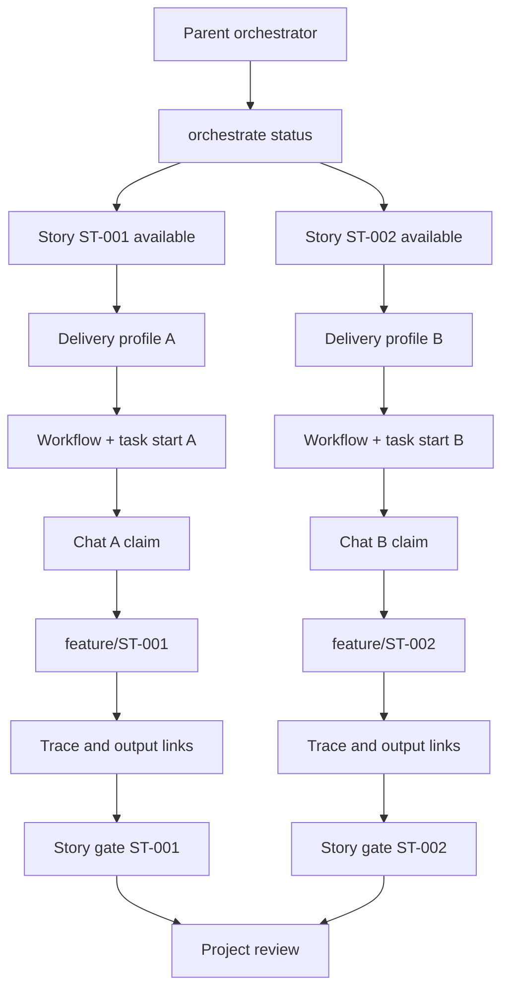

# Parallel Work

Agentic SDLC supports parallel work through story-scoped ownership and append-only traces.

## Rules

- One story should have one active claim at a time.
- Every worker that acts on a delivery must be covered by that delivery's current profile and effective autonomy decision; a profile for another PR, local release, or story is not authority.
- A delivery profile binds exactly one story/approved-contract pair and allows at most one concurrent delivery run. Several agents may perform bounded internal subtasks inside that orchestrated run, but they do not create additional delivery lanes or concurrent story claims from the same profile.
- Independent story lanes require their own delivery profiles and targets. If several changes must ultimately appear in one PR, first agree one aggregation story/contract and track subordinate work as bounded tasks/traces inside that single delivery unit.
- Each claim should name the agent, branch, and optional expiry.
- Implementation work should happen on a story branch such as `feature/ST-001`.
- Agents should append trace events instead of rewriting shared history.
- Agents should record actor, run/thread, branch, and head SHA metadata.
- Pushes, merges, handoffs, and claim changes should be recorded as trace events.
- Completed functional, technical, implementation, validation, or release lanes should be recorded with `story complete-step`.
- Cross-chat or cross-machine continuation should use `story prepare-handoff` so the receiving worker gets a story package with steps, outputs, dependencies, and recent traces.
- Durable outputs should be resolved and linked through the shared output-contract registry before they are treated as canonical.
- Approved dependency graph entries should be checked before claiming a story; hard blockers stop work lanes, soft dependencies provide context.
- If upstream artifacts change, downstream stories need a `dependency.revalidate` trace before they are no longer stale.
- Stories closed with `story supersede` or `story cancel` show as `closed`; they are never offered as lanes and no longer block their dependents. A dependency on a superseded story waits for its replacement instead.
- Output registry writes are serialized locally; still merge `.sdlc/output-contracts/registry.json` carefully across Git branches.
- Cache and indexes can be rebuilt locally by each chat, but derived files must not become handoff evidence.
- Teams should merge `.sdlc/` artifacts with the code changes they explain.

## Multiple Codex Chats

1. Confirm the approved requirement ceiling and the explicit profile for this exact pull request or local release and its one story/contract pair.
2. Run `orchestrate status --json`.
3. Pick an `available` story lane whose approved contract reserves its own profile ID and whose current profile binds that contract hash.
4. Verify that the exact story-bound workflow is active and that the immutable task-start receipt matches the current approved contract and profile.
5. Claim it with `story claim --thread-id <codex-thread-id>`.
6. Work only on that story branch and story KB files.
7. Resolve required outputs with `output resolve`; link artifacts with `output link`.
8. Append autonomy-decision, implementation, test, sync, and handoff traces.
9. Record completed lanes with `story complete-step`.
10. Prepare cross-lane or cross-machine handoffs with `story prepare-handoff --release-claim`.
11. Run `gate check --story <id> --strict --out .sdlc/reports/<story-id>-gate-report.json`.
12. Release the claim when done or handed off.

## Multiple Computers

Claim files and their locks only serialize work on one checkout. When the
project has a git remote, every claim is also created on it as
`refs/agentic-sdlc/claims/<story>/<epoch>/claim` before `claim.json` is
written, with a push the remote accepts only if the ref does not exist yet, so
exactly one computer wins a story. Releases, handoffs with `--release-claim`,
closures, and takeovers add `.../<epoch>/release`, after which the story can be
claimed again.

1. Publish the approved specs: requirements, story breakdown, contracts, and task starts, committed and pushed to the shared branch.
2. On each computer, pull that branch and run `orchestrate status --json`; stories claimed on any computer show as `claimed` with holder and branch.
3. Run `story availability --id <story> --json`, then claim one `available` story with `story claim` at the start of development, before editing; a refusal names who holds it.
4. Create the story branch, work, push, and open the story's pull request (or complete its local release).
5. Release the claim when done or handed off; if the release was not shared, run `story release` again once the remote is reachable.

No computer coordinates the others. Each agent claims and reserves only the work it does itself, on its own computer: inside an agent session a worktree holds one claimed story (`STORY_CLAIM_ONE_PER_WORKTREE`) and a computer one reservation (`STORY_RESERVE_ONE_PER_COMPUTER`) until it is finished or released. Never claim, reserve, release, cancel, or supersede a story on behalf of another computer: a story held here can only become work here, and the other computers' agents cannot free it. Assigning work across computers is the user's decision, run in their own terminal. `story cancel` and `story supersede` refuse a story claimed or reserved on another computer until that claim ends.

`orchestration_policy.coordination.mode` is `auto` (default), `required`, or
`local_only`. With sharing in effect, an unreachable remote refuses the claim:
claiming is the start of work. Taking over a story held elsewhere is a person's
decision (`--force --reason <why>` with a human actor, outside any agent
session); the release record tells the previous holder who took over and why.
A claim older than `orchestration_policy.stale_claim_after_seconds`, or past its
expiry, is listed as `stale`.

### Stories that change the same files

Claims are per story, so two stories in progress can both change one file. `story claim` warns when another story in progress has a write scope that shares files with the one being claimed. Whichever story merges second must review the other's merged change first: `story overlap --id <story>` lists the changes other stories merged after it started, and `story overlap confirm --id <story> --summary <what was checked>` records the review; until then `pull_request.merge` is refused and the strict story gate reports each change. `orchestration_policy.delivered_overlap` can turn this into a warning or off, or require a person to confirm.

When both stories change a shared file (for example `src/index.ts` exporting each feature), let the first one merge, then bring the second branch up to date by fast-forward (no own commits yet) or rebase onto the base branch; do not create a merge commit, `git.commit` refuses it. The second story's perimeter is the files its own commits touched: commits of other stories' merged deliveries are left out, while its own edit of the shared file still counts. If the first story was merged on GitHub outside the plugin, run `autonomy delivery reconcile` for it first. `git.commit` and `git.push` refuse a branch carrying commits that are neither the story's own nor part of a merged delivery, and name the commit to return to with `git reset --keep <sha>`. Commits that only touch `.sdlc/` records and a commit followed by its exact revert never count. A commit pushed straight to the base branch is accepted for one story by a person with `story base acknowledge --id <story> --commit <sha> --reason <why> --actor-type human`: its files leave the perimeter, and those inside the story's write scope or context need `story overlap confirm` before the merge.

Run `task start` and `story claim` at the start of development, not at integration time. Since commit 2e9c3ef, a story's perimeter counts only its own commits once other stories merged, so the shared claim can protect the work from the first moment. Use `story reserve` when the story cannot start yet. When stories were started from the same earlier main and one merges, the others are not blocked: after `baseline refresh`, a story whose start predates that merge (also through a replacement delivery, which keeps the first task start) passes the context check without the merged files on its branch, and its task preflight does not bind them. Its own changes stay checked by its perimeter; fast-forward or rebase onto main when it needs the merged work.

### Reserve a story before it can start

`story reserve --id <story> --agent <name> [--expires-in <90m|12h|3d|1w>] [--expires-at <ISO time>] [--branch <planned-branch>]` books a story that cannot start yet, for example because its dependencies are not satisfied. It needs no task start, writes nothing in the project, and fixes no starting point: the perimeter and its base stay those of the later `task start`.

The reservation is a shared claim record marked `"reservation": true`, so older plugin versions treat it as a claim. It belongs to the computer, not to one worktree. Other computers see "reserved by X until Y"; their `story claim` is refused with `STORY_CLAIM_HELD_ELSEWHERE`, and only a person takes it over, like a claim. Your own `story claim`, run after `task start`, turns the reservation into the claim.

A reservation always expires (default 24 hours, maximum 30 days, set in `orchestration_policy.reservation`); after that the story is free without a takeover. `story release --id <story>` ends it earlier. It is refused (`STORY_RESERVE_NOT_SHARED`) when claims are not shared or the remote cannot be reached.

Before `task start`, run `story availability --id <story> --json`. If `safe_to_start` is false, stop, tell the user who holds or reserved the story, or which branch or pull request names it and how recently, and ask whether to proceed. Never decide for them and never retry with `--force`.

### Work on the remote that nobody claimed

For a story nobody claimed or reserved, `status`, `orchestrate status`, and `story availability` warn when a remote-tracking branch names the story id and has commits not yet on the base branch. With `orchestration_policy.unclaimed_remote_work.pull_requests: github-cli`, open pull requests naming the story are read too. The warning never blocks; the decision stays with the person. Show it to the user as printed and ask whether to continue.

## Parent Orchestrator Chat

A parent chat can coordinate several worker chats on the same computer without editing their story files directly. It never assigns, claims, or reserves stories for other computers: each computer's agent claims its own (see Multiple Computers).

1. Run `orchestrate plan --json`.
2. Assign one story per worker chat.
3. Monitor claims, stale claims, locks, and handoffs with `orchestrate status`.
4. Require each worker to write attributed trace and sync evidence.
5. Resolve conflicts by splitting stories, releasing/reclaiming claims after coordination, or using phase locks.
6. Run project-wide `gate check --scope all --strict --out .sdlc/reports/project-gate-report.json` before release.

The parent may distribute story work only across separately governed delivery lanes, or distribute internal subtasks inside one aggregation-story run without inventing extra story authority. It cannot raise a worker above the most restrictive host, project, requirement, delivery, contract, capability, environment, or budget boundary. Protected-branch merge and remote/production deployment remain explicit decisions outside ordinary worker coordination.

## Conflict Handling

If two agents need the same story, split the story or coordinate release and reclaim. Do not use `--force` on a claim unless a human has decided the previous claim is stale or invalid; for a claim held on another computer, the person runs the takeover in their own terminal.

Use phase locks only for shared artifacts such as global analysis, release notes, or architecture decisions. Do not lock the whole project for ordinary story-scoped implementation.
